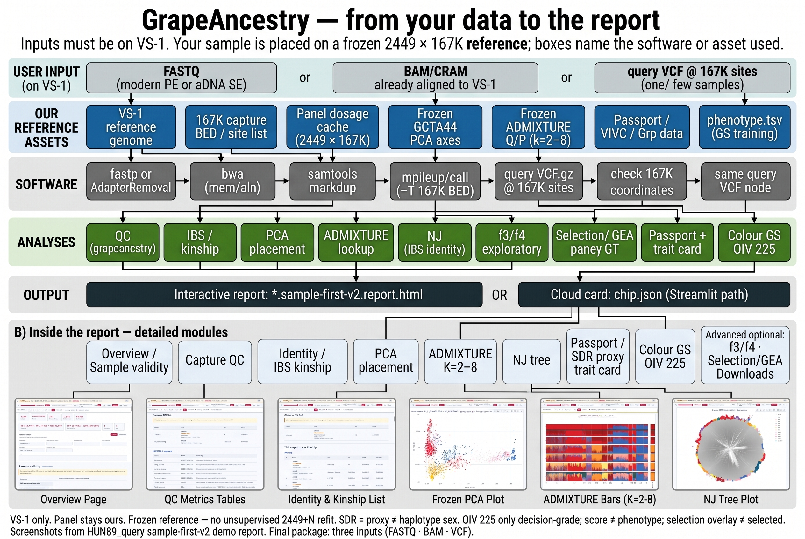

# grapeancestry

Analysis companion for the grapevine **167K capture panel**.

**Status:** documentation and demo walkthrough are live. Full pipeline code, Streamlit Cloud, and large panel matrices land later — do not expect `grapeancestry run` from this repo yet.

## Analysis flow

Final package inputs: **FASTQ** · **BAM/CRAM** · **query VCF** — all on **VS-1** — then our 2449 × 167K assets, software, analyses, and report / `chip.json`.

Source notes: [`docs/FLOWCHART.md`](docs/FLOWCHART.md) · full teaching text: [`docs/GUIDELINE.md`](docs/GUIDELINE.md).

| Input | What it is |
|-------|------------|
| **FASTQ** | Modern PE or aDNA SE → trim → map to VS-1 → call at 167K BED |
| **BAM / CRAM** | Already on VS-1 → markdup → call at 167K BED |
| **Query VCF** | Customer sample at 167K sites — **not** the 2449 panel matrix |

> **ID trap:** Panel demo `HUN89` (2449-row ID) ≠ capture demo `HUN89_query` (independent FASTQ recapture).

### Claim boundaries

| Class | Rule |
|-------|------|
| Decision-grade | **OIV 225** colour GS only |
| Exploratory | OIV 241 / unbalanced traits — no parent ranking / seedlessness claim |
| Do not claim | SDR ≠ haplotype sex; selection overlay ≠ selected; **score ≠ phenotype** |

> Classroom note: Cloud → `chip.json`; Suite → `*.sample-first-v2.report.html`. Pick one deliverable.

---

## Walk the demo report

Demo: `HUN89_query.sample-first-v2.report.html`. Each block below is one sidebar section (full long screenshot) plus a short read note. Longer commentary lives in [`docs/GUIDELINE.md`](docs/GUIDELINE.md).

### 1 · Sample validity

Read panel calling rate, depth, and capture tables first. Heterozygosity is a screen, not a purity call. Missing aDNA damage on a modern PE library is expected.

### 2 · Identity & placement

IBS / kinship vs the 2449 panel. Non-self Identical and PO are clone/parentage **screens**. Pin a row to overlay the same ID on PCA / ADMIXTURE / NJ.

### 3 · Population placement

Frozen GCTA64 PCA projection, ADMIXTURE (lookup or `-P` / NNLS), NJ on IBS identity, optional f3/f4. Query is placed on a **frozen** reference — not an unsupervised 2449+N refit.

PCA · ADMIXTURE · NJ detail:

### 4 · Sample evidence

Passport / VIVC, SDR **proxy** (not Science H1–H5 haplotype sex), trait card, colour GS. Only **OIV 225** is decision-grade today.

### 5 · Panel research

Selection / GEA and related panel contrasts. Query GT is an **overlay**, not proof that this sample was selected.

### 6 · Methods

Software and frozen-asset notes for the report you are reading.

### 7 · Downloads

Export tables and figures from the demo; no unpublished full 2449 matrices in the public tree.

---

## Layout

| Path | Role |
|------|------|
| [`docs/`](docs/) | GUIDELINE, FLOWCHART, demo section screenshots |
| [`chip/`](chip/) | Probe / SNP selection for 167K (design files land later) |
| [`analysis/`](analysis/) | Calling and report recipes when filled |

The old standalone shell [grapevine-chip](https://github.com/Xuzhen-Li/grapevine-chip) redirects to `chip/`.

## This is not

- Not an aDNA authentication pipeline → [grapevine-adna](https://github.com/Xuzhen-Li/grapevine-adna)
- Not theory dossiers → [genomics-theory-mining](https://github.com/Xuzhen-Li/genomics-theory-mining)
- Not a nuclear pangenome / PAV graph → [vitis-pangenome](https://github.com/Xuzhen-Li/vitis-pangenome)

## Privacy

No unpublished genotypes, private coordinates, or full 2449 panel matrices in this public tree.

## Author

**Xuzhen Li** · [ORCID 0000-0003-3670-6657](https://orcid.org/0000-0003-3670-6657)
