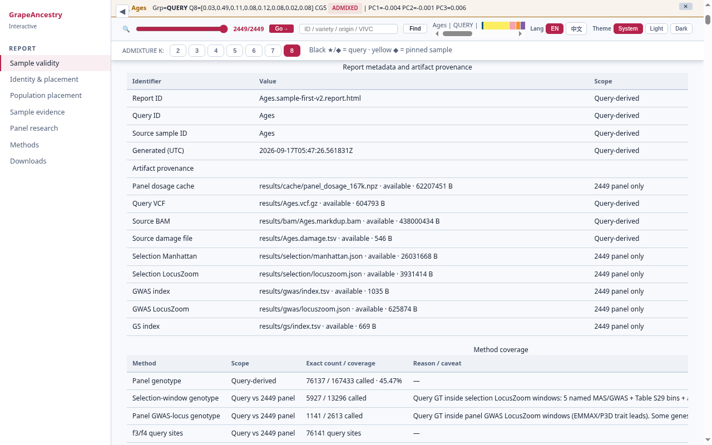
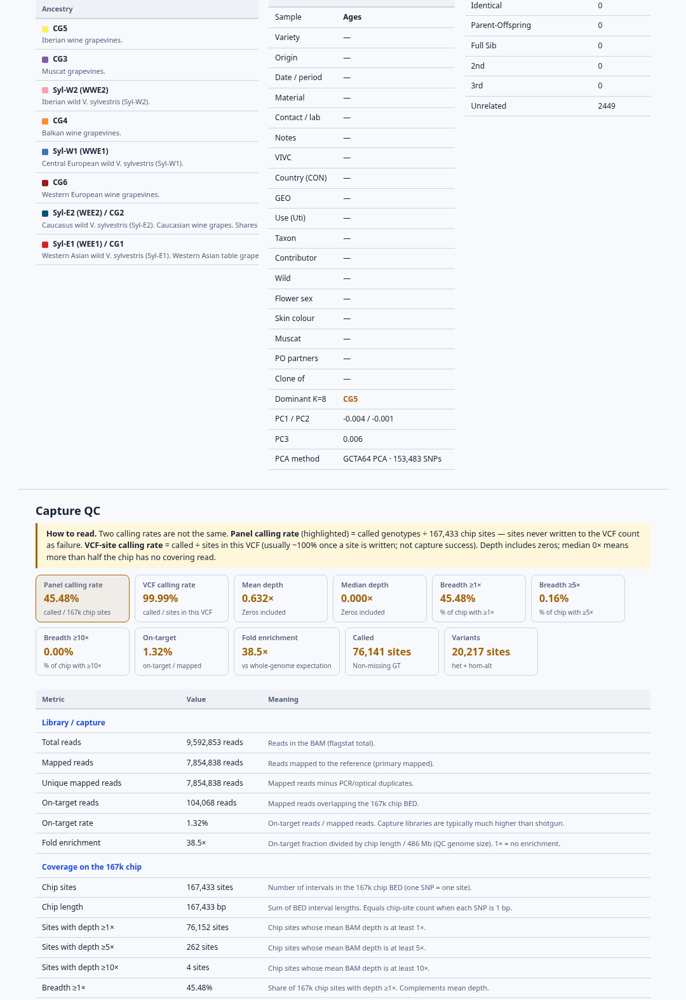
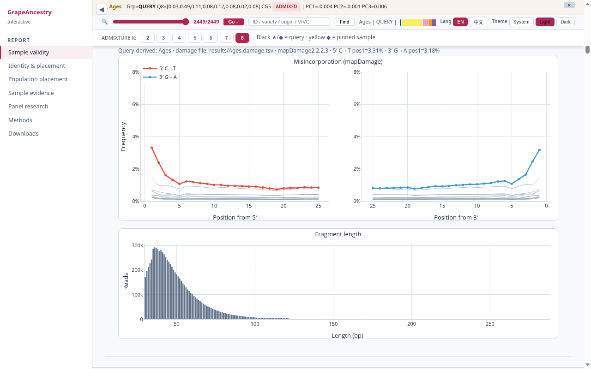
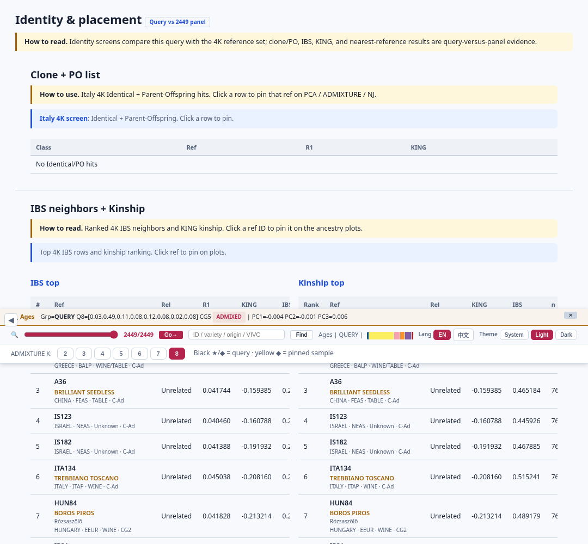
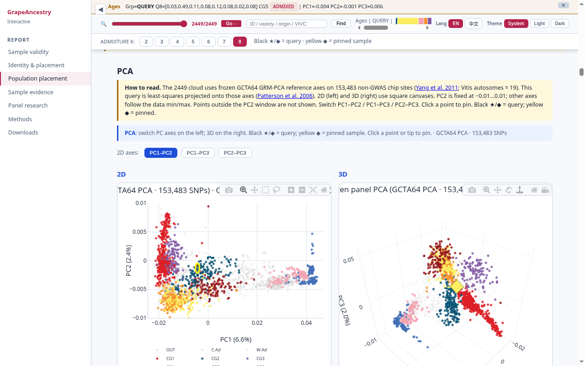
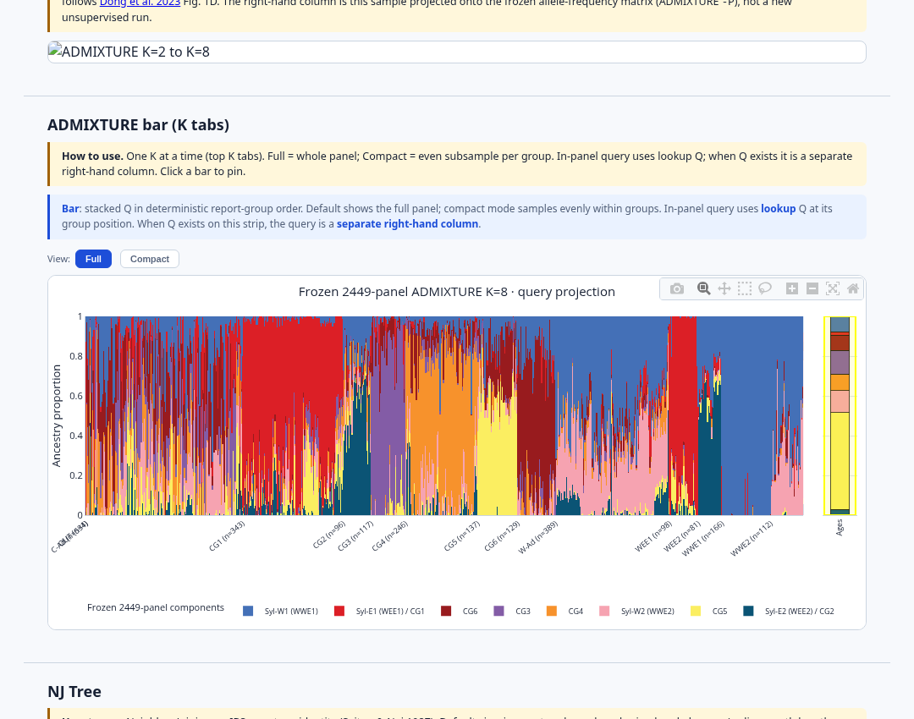
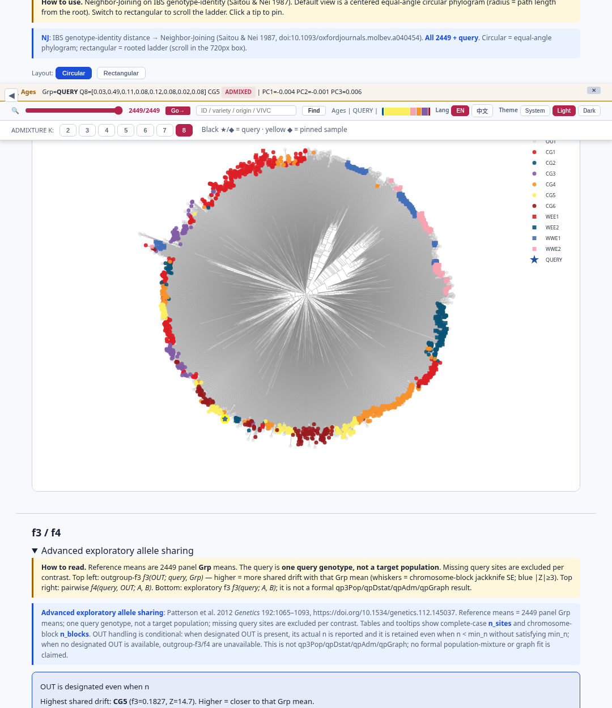
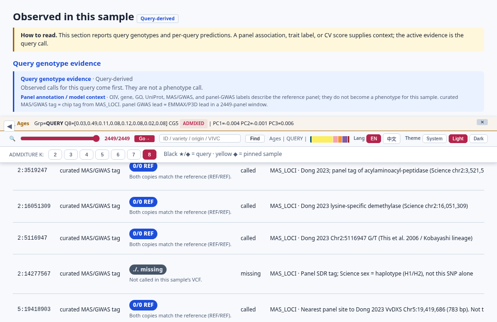
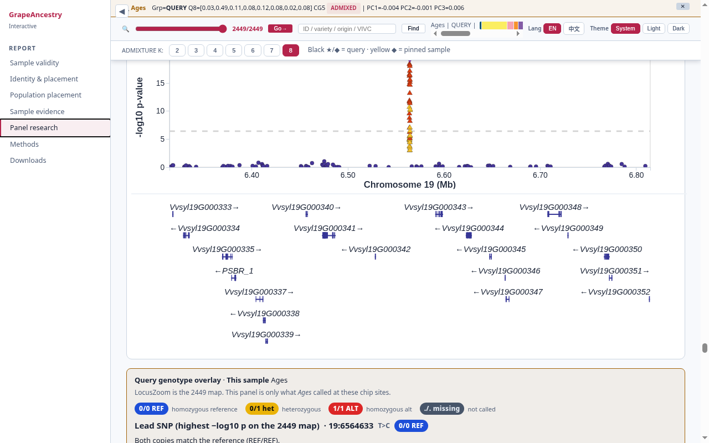

# grapeancestry

**GrapeAncestry v1.0.0** — local Docker app for the grapevine **167K** capture panel on **VS-1**. Place a new query on frozen panel axes and open a sample-first V2 HTML report.

Not a whole-genome resequencing suite. Optional cross-crop scaffold: [gtbs-chip-service-kit](https://github.com/Xuzhen-Li/gtbs-chip-service-kit).

[](LICENSE)
[](https://orcid.org/0000-0003-3670-6657)

## What this is

GrapeAncestry places a **new grapevine query** against a **frozen 2449 × 167K** reference on **VS-1** (Dong et al. 2023 *Science*, [doi:10.1126/science.add8655](https://doi.org/10.1126/science.add8655)). Same sample → capture QC, identity/kinship, frozen PCA + ADMIXTURE, IBS NJ tree, passport-style cards, and — where evidence supports ranking — colour genomic selection.

- Query VCF = **167K sites**, not the 2449 dosage matrix.
- PCA / ADMIXTURE are **frozen**; new samples are projected.
- Only **OIV 225** colour GS is decision-grade today; **score ≠ phenotype** (rules in GUIDELINE).
- **ID trap:** panel row `HUN89` ≠ report stem `HUN89_query`.

**MIT = code only.** Panel genotypes / phenotypes are not MIT. Full data policy: [`DATA_NOTICE.md`](DATA_NOTICE.md).

## Three ways in

| Path | What you do | Outcome |
|------|-------------|---------|
| **Docker kit** | Download tar from **`[DOCKER_TAR_URL — fill before publish]`**, put next to `start.sh`, run `./start.sh` | Product report **`*.sample-first-v2.report.html`** (UI **8501** · reports **8502**) |
| **Demo on GitHub** | Screenshots below + [`docs/GUIDELINE.md`](docs/GUIDELINE.md) + [`demo/`](demo/) Ages HTML | **View-only** — no product report from this path |
| **DIY, no kit** | Stage your own VS-1 + frozen 2449×167K panel assets (FASTA/indices, sites BED, dosage, PCA·ADMIXTURE) — not in public git. Follow [`docs/steps/`](docs/steps/) / [`docs/DIY_SPINE.md`](docs/DIY_SPINE.md) `00a`–`13b`. | Your own **`*.sample-first-v2.report.html`** |

**v1 product report is `*.sample-first-v2.report.html` only.** Optional Cloud `chip.json` is classroom/Cloud demoted — not a fourth parallel path ([`docs/CHIP_COMPANION.md`](docs/CHIP_COMPANION.md)).

## Path A — Docker kit (load published tar)

1. Download **`grapeancestry-v1.0.0-amd64.tar`** from **`[DOCKER_TAR_URL — fill before publish]`** (published elsewhere — not a public GitHub Release).
2. Place the tar next to `start.sh` / `start.command` / `start.bat` in this repo (or your customer drop folder).
3. Run:

```bash
./start.sh
# macOS: double-click start.command
# Windows: start.bat
```

The launcher creates `input/` `output/` `settings/`, loads `grapeancestry:1.0.0` from the tar when needed, and starts the container on **8501** + **8502**.

4. Open **http://127.0.0.1:8501** — first visit **Setup** (password twice, language, threads, optional lab name). Hash only in `./settings/auth.json` (scrypt). Later visits: password only.
5. Sidebar: **Analysis** / **Demos** / **Settings**. Put FASTQ / BAM / VCF in `./input` (drag-and-drop, host copy, **Get Ages** / **Get HUN89_query**, or http(s) URL).
6. Open the product report **`*.sample-first-v2.report.html`** on **http://127.0.0.1:8502** (copies under `./output/results/` + `./output/assets/`).

**Never `docker push`** the fat image (panel inside). A docs-only clone **without** the tar cannot finish Analyze.

Detail: [`docs/USER_GUIDE.md`](docs/USER_GUIDE.md).

### BAM / intake rules (kit)

- Accepted BAM = **VS-1** numeric contigs. `chr1` / 12X / PN40024 → fail → use FASTQ.
- Sample URL in the UI download box (**download demo only**, not a VS-1 BAM):  
  `https://ftp.sra.ebi.ac.uk/vol1/run/ERR166/ERR16654874/V5xL1xP2_Ages_3_5070.12Xv2.realigned.bam`  
  ENA **ERR16654874** / **PRJEB94459**. File is **12Xv2** — Analyze-as-BAM must fail `@SQ`.
- Treat as query on → report id `{id}_query`.
- Step knobs = existing flags only (fastp, AdapterRemoval3, `bwa mem -k/-T`, `bwa aln -l/-n/-o`, `bcftools` `-q/-Q/-d/-C`, `--forceall`, `--pca-color`, `--admix-mode`, K=2–8).
- Packed demos: **Ages** + **HUN89_query** (**ID trap:** panel row `HUN89` ≠ report stem `HUN89_query`).
- **v1 product report is `*.sample-first-v2.report.html` only** — optional `chip.json` is demoted Cloud/classroom, not a parallel hand-in.

## Path B — Demo on GitHub (no Docker)

Browse the shipped Ages report:

```bash
cd demo
python3 -m http.server 8000
# http://127.0.0.1:8000/results/Ages.sample-first-v2.report.html
```

Keep `demo/assets/` beside `demo/results/`. How to read the sidebar: [`docs/GUIDELINE.md`](docs/GUIDELINE.md).

### Screenshot gallery (Ages)

Packed demos include Ages and HUN89_query — panel id `HUN89` is not the same as report stem `HUN89_query`.



*Sample validity — report metadata and method coverage for the Ages aDNA demo (V5; Noraz et al. 2026). *



*Sample validity — capture QC (depth, calling, on-target) on the 167K sites.*



*aDNA damage — terminal misincorporation and fragment-length patterns (Ages).*



*Identity — clone / parent–offspring screen and IBS kinship (panel `HUN89` ≠ stem `HUN89_query`).*



*Population — query projected onto frozen GCTA64 PCA axes (VS-1 frame).*



*Population — ADMIXTURE using frozen Q/P for K=2–8 (no 2449+N refit).*



*Population — IBS neighbour-joining tree (use with identity tables).*



*Sample evidence — only **OIV 225** colour GS is decision-grade (**score ≠ phenotype**).*



*Panel research — LocusZoom regional panel map with query GT overlay (overlay ≠ “this sample was selected”).*

More panels (incl. methods / downloads): [`docs/GUIDELINE.md`](docs/GUIDELINE.md).

**Ages source cite:** Noraz et al. 2026 *Nat Commun* ([doi:10.1038/s41467-026-70166-z](https://doi.org/10.1038/s41467-026-70166-z); incl. **Ludovic Orlando**). Sample **V5** as stated in that paper.

## Path C — DIY without our kit

“Kit” here means the private Docker drop and/or [gtbs-chip-service-kit](https://github.com/Xuzhen-Li/gtbs-chip-service-kit).

If you run the workflow yourself:

1. Stage your own VS-1 + frozen 2449×167K panel assets (FASTA/indices, sites BED, dosage, PCA·ADMIXTURE) — not in public git.
2. Follow the numbered workflow **[`docs/steps/`](docs/steps/) `00a` → `13b`**: prep → trim/map/call → QC → identity → placement → report HTML.
3. Use commands that already live in `src/grapeancestry/`, `workflow/Snakefile`, and `config/` (map: [`docs/SCRIPTS.md`](docs/SCRIPTS.md) · science: [`docs/PIPELINE.md`](docs/PIPELINE.md)).

Optional Cloud JSON (`14a`–`14b`) is demoted — not required for v1.

```bash
python3 -m venv .venv && source .venv/bin/activate
pip install -e .
# Without local VS-1 + panel caches, analyze/run are expected to stop.
```

## Analysis flow

FASTQ / BAM / query VCF → **VS-1** → 167K sites → analyses → **`*.sample-first-v2.report.html`**.


*Detail + claim caption: [`docs/FLOWCHART.md`](docs/FLOWCHART.md). VS-1: Dong et al. 2023 *Science* ([doi:10.1126/science.add8655](https://doi.org/10.1126/science.add8655)).*


ADMIXTURE 1.3.0 (linux x86_64): [download](https://dalexander.github.io/admixture/download.html).

## Manuals

| Doc | Role |
|-----|------|
| [`docs/USER_GUIDE.md`](docs/USER_GUIDE.md) | How to start (kit + public browse) |
| [`docs/FAQ.md`](docs/FAQ.md) · [`docs/GLOSSARY.md`](docs/GLOSSARY.md) | First hour, FAQ, terms |
| [`docs/GUIDELINE.md`](docs/GUIDELINE.md) | How to read the report |
| [`docs/steps/`](docs/steps/) · [`docs/DIY_SPINE.md`](docs/DIY_SPINE.md) | How to reproduce (DIY `00a`–`13b`) |
| [`docs/GROKBOT_GITHUB_PROMPTS.md`](docs/GROKBOT_GITHUB_PROMPTS.md) | Worker cards for maintainers |

## Author

**李旭真 / Li Xuzhen** · [ORCID 0000-0003-3670-6657](https://orcid.org/0000-0003-3670-6657)
