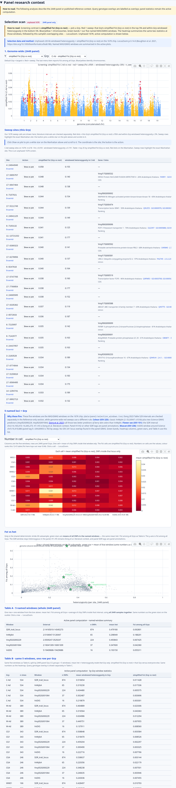
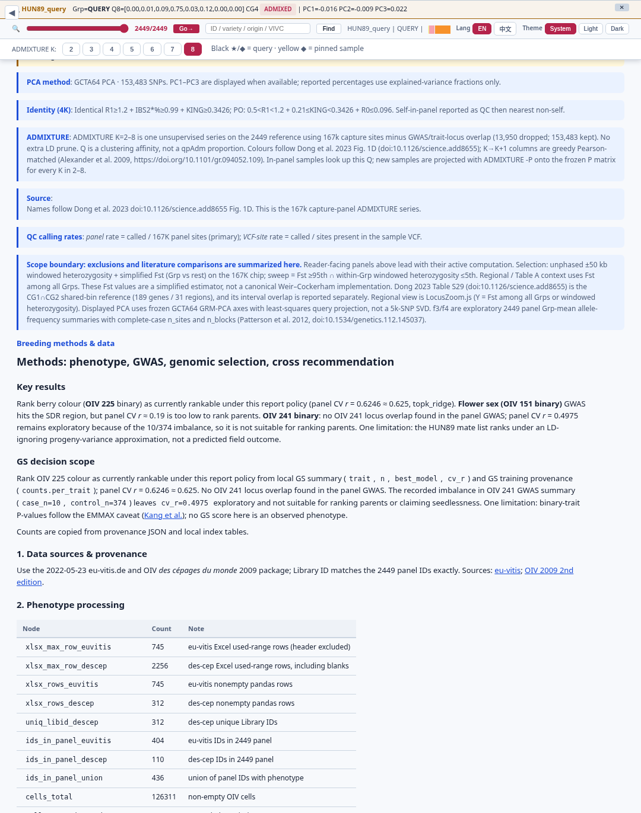
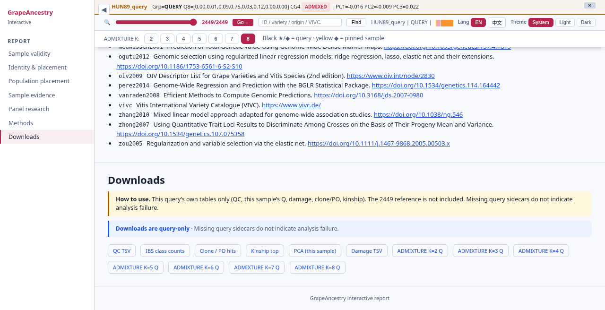

# grapeancestry

Analysis companion for the grapevine **167K capture panel** — reports and Chip Companion, not a black-box resequencing suite.

[](LICENSE)
[](https://orcid.org/0000-0003-3670-6657)

## What this is

This repo is for breeders and classrooms that hand in a **query** sample or open a demo report. Sites are called on **VS-1** and compared to a **frozen 2449 × 167K** panel (dosage, PCA axes, ADMIXTURE Q/P). Your input is FASTQ, BAM/CRAM on VS-1, or a query VCF at the 167K sites — that VCF is **not** the panel matrix. New samples are projected onto the frozen reference (`-P` / NNLS), not used to refit the panel. The public tree ships **docs and a demo walkthrough** first; full `run` and matrices land later.


*Solid path: your input → our frozen assets → analyses → report or `chip.json`. Detail: [`docs/FLOWCHART.md`](docs/FLOWCHART.md).*

Only **OIV 225** colour GS is decision-grade today; claim rules live in the GUIDELINE.

## How to use (usage flow)

**Default today: read the docs and the demo walkthrough.** This GitHub tree does not yet ship a runnable `grapeancestry` CLI.

Full step-by-step lives in [`docs/GUIDELINE.md`](docs/GUIDELINE.md) — three lanes, report chrome (pin / K / theme), and **what each screenshot is for**.

| Lane | Who | What you do | Hand-in |
|------|-----|-------------|---------|
| **A · Public docs** | Anyone | Read GUIDELINE + flowchart + CHIP_COMPANION; use screenshots as the walkthrough | — |
| **B · Local suite** | Lab Mac with private suite | `pip install -e ".[dev,web]"` → `grapeancestry run …` (FASTQ→HTML) or post-VCF `analyze` / `identity` / `chip-report` | `*.sample-first-v2.report.html` |
| **C · Cloud** | Classroom Streamlit | Upload **167K query VCF** (not FASTQ) | `chip.json` |

View an existing HTML demo from the **suite root** (view-only):

```bash
cd /path/to/local-suite
python -m http.server
# http://localhost:8000/results/HUN89_query.sample-first-v2.report.html
```

Panel ID `HUN89` ≠ report stem `HUN89_query`. Diagram: [`docs/FLOWCHART.md`](docs/FLOWCHART.md) · Cloud notes: [`docs/CHIP_COMPANION.md`](docs/CHIP_COMPANION.md).

**Three inputs, one line:** FASTQ / BAM / query VCF → **VS-1** → 167K sites → analyses (flowchart above).

## Demo panels

Non-overlapping panel crops from the demo report. Each image has a short caption in [`docs/GUIDELINE.md`](docs/GUIDELINE.md). Hand-in is a **filename**, not every sidebar tab.

**Sample validity** — provenance, QC, damage note


**Identity** — clone / PO, then IBS neighbors (pin to overlay)


**PCA · ADMIXTURE · NJ** — frozen projection, not a panel refit


**Sample evidence** — query GT at MAS/GWAS sites; OIV 225 only decision-grade


**Panel research** — 2449 context; query GT is overlay only



**LocusZoom** — regional panel map + this sample’s genotypes


**Methods · Downloads**





## Related

[grapevine-adna](https://github.com/Xuzhen-Li/grapevine-adna) · [genomics-theory-mining](https://github.com/Xuzhen-Li/genomics-theory-mining) · [vitis-pangenome](https://github.com/Xuzhen-Li/vitis-pangenome) · [grapevine-chip](https://github.com/Xuzhen-Li/grapevine-chip)

No unpublished genotypes or full 2449 matrices in this public tree. **Xuzhen Li** · [ORCID](https://orcid.org/0000-0003-3670-6657)
