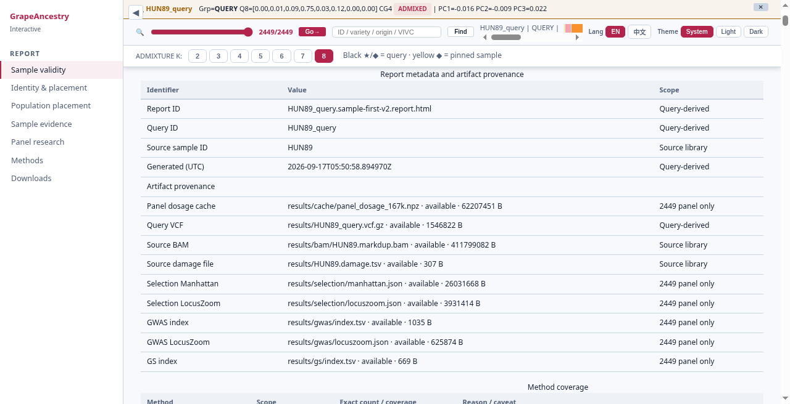

# grapeancestry

Analysis companion for the grapevine **167K capture panel** — reports and Chip Companion, not a black-box resequencing suite.

[](LICENSE)
[](https://orcid.org/0000-0003-3670-6657)

## What this is

This repo is for breeders and classrooms that hand in a **query** sample or open a demo report. Sites are called on **VS-1** and compared to a **frozen 2449 × 167K** panel (dosage, PCA axes, ADMIXTURE Q/P). Your input is FASTQ, BAM/CRAM on VS-1, or a query VCF at the 167K sites — that VCF is **not** the panel matrix. New samples are projected onto the frozen reference (`-P` / NNLS), not used to refit the panel. The public tree ships **docs and a demo walkthrough** first; full `run` and matrices land later.


*Solid path: your input → our frozen assets → analyses → report or `chip.json`. Detail: [`docs/FLOWCHART.md`](docs/FLOWCHART.md).*



*Start of the demo report. The hand-in is a filename (`chip.json` or `*.sample-first-v2.report.html`), not every sidebar tab. Full section walk: [`docs/GUIDELINE.md`](docs/GUIDELINE.md).*

Only **OIV 225** colour GS is decision-grade today; claim rules live in the GUIDELINE.

## How to use

1. **Open the demo (today).** From the local suite root so assets resolve:

```bash
cd grapeancestry_suite
python -m http.server
# http://localhost:8000/results/HUN89_query.sample-first-v2.report.html
```

`http.server` is view-only; it does not create the hand-in. Panel ID `HUN89` ≠ report stem `HUN89_query`.

2. **Pick one deliverable.** Cloud → `chip.json` from a 167K-site query VCF. Suite / demo → `*.sample-first-v2.report.html`. On this public docs repo, prefer Cloud-when-ready or open the demo and read the GUIDELINE.

```bash
grapeancestry chip-report --vcf sample.vcf.gz --out chip.json
```

3. **Three inputs, one line.** FASTQ / BAM / query VCF → **VS-1** → 167K sites → analyses (see flowchart).

| Next doc | For |
|----------|-----|
| [`docs/GUIDELINE.md`](docs/GUIDELINE.md) | Sidebar walk + reading notes |
| [`docs/CHIP_COMPANION.md`](docs/CHIP_COMPANION.md) | Cloud companion |
| [`docs/FLOWCHART.md`](docs/FLOWCHART.md) | Diagram node list |

## Related

[grapevine-adna](https://github.com/Xuzhen-Li/grapevine-adna) · [genomics-theory-mining](https://github.com/Xuzhen-Li/genomics-theory-mining) · [vitis-pangenome](https://github.com/Xuzhen-Li/vitis-pangenome) · [grapevine-chip](https://github.com/Xuzhen-Li/grapevine-chip)

No unpublished genotypes or full 2449 matrices in this public tree. **Xuzhen Li** · [ORCID](https://orcid.org/0000-0003-3670-6657)
