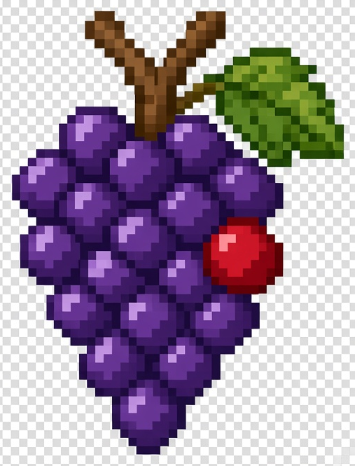
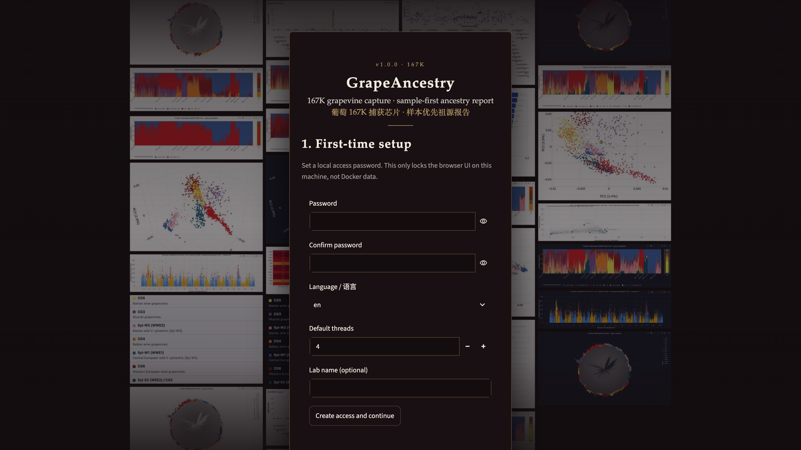

  

# GrapeAncestry

**GrapeAncestry v1.0.0** places a new grapevine query on a frozen **2449 × 167K** panel built on **VS-1**, then writes a sample-first V2 HTML report.

Not a whole-genome resequencing suite. **MIT = code only** (panel genotypes/phenotypes are not MIT — [`DATA_NOTICE.md`](DATA_NOTICE.md)). Author: **李旭真 / Li Xuzhen** · [ORCID 0000-0003-3670-6657](https://orcid.org/0000-0003-3670-6657).

## Analysis flow

**FASTQ / BAM (already on VS-1) / query VCF → VS-1 → 167K sites → `*.sample-first-v2.report.html`.**

Solid/dashed rules: [`docs/FLOWCHART.md`](docs/FLOWCHART.md). VS-1: Dong et al. 2023 Science ([doi:10.1126/science.add8655](https://doi.org/10.1126/science.add8655)).

## Use it

| Path | What you do | Outcome |
|------|-------------|---------|
| **Docker kit** | Download `grapeancestry-v1.0.0-amd64.tar` from Zenodo Restricted ([doi:10.5281/zenodo.22868632](https://doi.org/10.5281/zenodo.22868632)); put next to `./start.sh`; run it | Product **`*.sample-first-v2.report.html`** — UI **http://127.0.0.1:8501** · reports **:8502** |
| **Demo** | `cd demo && python3 -m http.server 8000` → Ages HTML | **View-only** showcase |
| **DIY** | Stage your own VS-1 + frozen 2449×167K assets (not in git) | See **Docs** for `docs/steps/` |

**Docker (short):** `./start.sh` (macOS `start.command` / Windows `start.bat`) creates `input/` `output/` `settings/`, loads `grapeancestry:1.0.0` when missing, and opens the UI. A docs-only clone without the tar cannot finish Analyze. Never `docker push` the fat image. Detail: [`docs/USER_GUIDE.md`](docs/USER_GUIDE.md).

v1 deliverable is **`*.sample-first-v2.report.html` only** (optional Cloud `chip.json` is not a fourth path).

## What you get

*First run — setup waterfall: local password, language, and threads (locks UI access only; does not encrypt data).*

Screenshot gallery — Ages demo (existing shots only). Packed demos include Ages and HUN89_query — panel id `HUN89` ≠ report stem `HUN89_query`. Walkthrough: [`docs/GUIDELINE.md`](docs/GUIDELINE.md). Cite Ages/V5: Noraz et al. 2026 *Nat Commun* ([doi:10.1038/s41467-026-70166-z](https://doi.org/10.1038/s41467-026-70166-z)).

*Sample validity — report metadata and method coverage for the Ages aDNA demo (V5; Noraz et al. 2026).*

*Sample validity — capture QC (depth, calling, on-target) on the 167K sites.*

*aDNA damage — terminal misincorporation and fragment-length patterns (Ages).*

*Identity — Ages clone / parent–offspring screen and IBS kinship vs the frozen panel.*

*Population — query projected onto frozen GCTA64 PCA axes (VS-1 frame).*

*Population — ADMIXTURE using frozen Q/P for K=2–8 (no 2449+N refit).*

*Population — IBS neighbour-joining tree (use with identity tables).*

*Sample evidence — only **OIV 225** colour GS is decision-grade (**score ≠ phenotype**); SDR remains a proxy.*

*Panel research — LocusZoom regional panel map with query GT overlay (overlay ≠ “this sample was selected”).*

## Docs

| Doc | Role |
|-----|------|
| [`DATA_NOTICE.md`](DATA_NOTICE.md) | What is / is not in git; Docker tar policy |
| [`docs/USER_GUIDE.md`](docs/USER_GUIDE.md) | Start kit + browse; BAM/intake |
| [`docs/GUIDELINE.md`](docs/GUIDELINE.md) | How to read the report |
| [`docs/FAQ.md`](docs/FAQ.md) | First hour |
| [`docs/GLOSSARY.md`](docs/GLOSSARY.md) | Terms (167K vs 2449) |
| [`docs/REPO_MAP.md`](docs/REPO_MAP.md) | What each top-level folder is |
| [`docs/steps/`](docs/steps/) | DIY `00a`–`13b` |
| [`docs/CODE_AVAILABILITY.md`](docs/CODE_AVAILABILITY.md) | Git URL + Docker / Zenodo note |
| [`docs/FLOWCHART.md`](docs/FLOWCHART.md) | Flowchart claim caption |

## Author

**李旭真 / Li Xuzhen** · [ORCID 0000-0003-3670-6657](https://orcid.org/0000-0003-3670-6657)

Related: [gtbs-chip-service-kit](https://github.com/Xuzhen-Li/gtbs-chip-service-kit) · [grapevine-adna](https://github.com/Xuzhen-Li/grapevine-adna) · [genomics-theory-mining](https://github.com/Xuzhen-Li/genomics-theory-mining)
