

  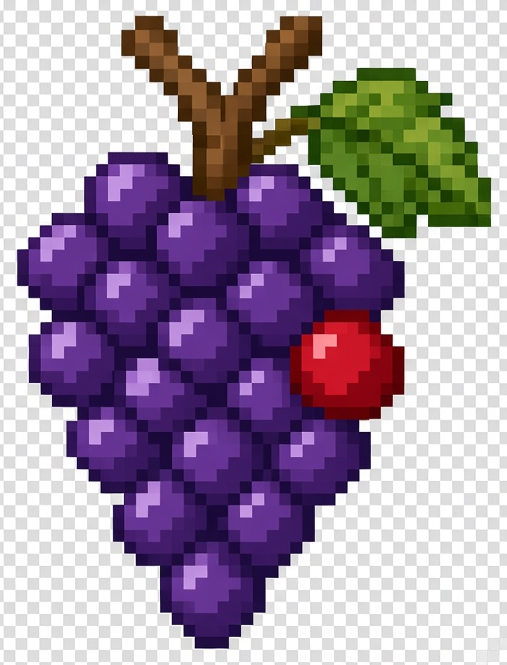

# GrapeAncestry

**GrapeAncestry v1.1.0** places a new grapevine query on a frozen **2449 × 167K** panel built on **VS-1**, then writes a sample-first V2 HTML report. A batch of queries can share one report.

Not a whole-genome resequencing suite. **MIT = code only** (panel genotypes/phenotypes are not MIT — [`DATA_NOTICE.md`](DATA_NOTICE.md)). Author: **李旭真 / Li Xuzhen** · [ORCID 0000-0003-3670-6657](https://orcid.org/0000-0003-3670-6657).

  <a href="https://xuzhen-li.github.io/grapeancestry/demo/results/ramos2019_np.batch.report.html"><strong>Open the demo</strong></a> 
  28 archaeological seeds · Ramos-Madrigal et al. 2019 <em>Nat. Plants</em>

## What's new in v1.1

v1.1 adds a relationship graph for a batch of queries. The queries and the panel varieties they match are drawn on one graph, and those queries are placed together on PCA, ADMIXTURE, and the NJ tree. The figure is that graph, from the 28-seed demo.

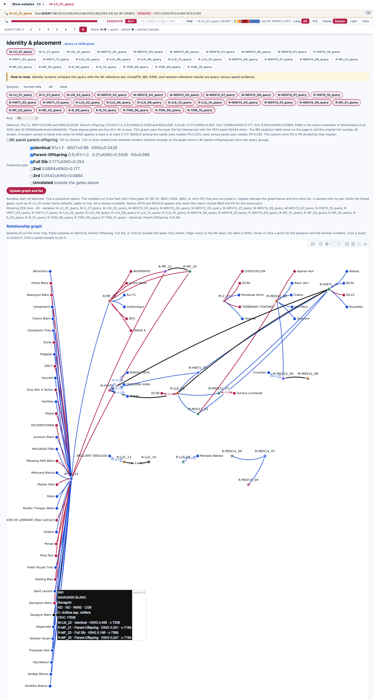

*v1.1 new feature. Blue nodes are queries. Red nodes are panel varieties. Edge colour is the relationship class (identical, parent–offspring, full sib, and more distant).* [Open the live report](https://xuzhen-li.github.io/grapeancestry/demo/results/ramos2019_np.batch.report.html).

## Analysis flow

**FASTQ, BAM, or VCF → trim and map to VS-1 → markdup → SNP calling at the 167,433 target sites → QC, relatedness, PCA, ADMIXTURE, NJ, damage → interactive report.**

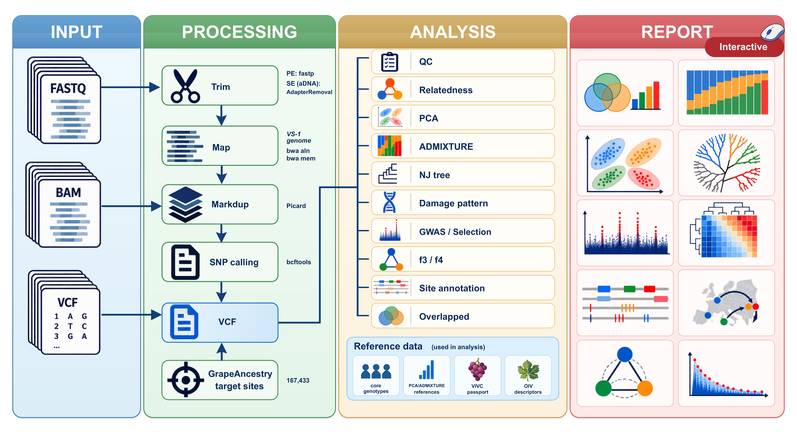

Overview of input, processing, analysis, and the interactive report. Reference data used in the analysis: core genotypes, frozen PCA/ADMIXTURE references, VIVC passport, and OIV descriptors. Step map and claim boundaries: [`docs/FLOWCHART.md`](docs/FLOWCHART.md). VS-1: Dong et al. 2023 Science ([doi:10.1126/science.add8655](https://doi.org/10.1126/science.add8655)).

## What it does

- Takes FASTQ, a BAM already on VS-1, or a VCF at the 167K panel sites
- Places the sample on a frozen 2449-sample × 167K-site VS-1 panel
- Screens clones and parent–offspring, and reports IBS kinship against the panel
- Projects the sample onto frozen PCA axes and ADMIXTURE K=2–8, and draws an NJ tree
- Batch report: the v1.1 relationship graph above, plus joint PCA, ADMIXTURE, and NJ placement
- Summarises aDNA damage for ancient samples
- Reports an OIV 225 berry-colour genomic score (score ≠ phenotype)
- Writes one self-contained HTML report per sample; the kit runs locally in Docker

## Use it

| Path | What you do | Outcome |
|------|-------------|---------|
| **Docker kit** | Download `grapeancestry-v1.1.0-amd64.tar` from Zenodo Restricted ([doi:10.5281/zenodo.22868632](https://doi.org/10.5281/zenodo.22868632)); put next to `./start.sh`; run it | Product **`*.sample-first-v2.report.html`** — UI **http://127.0.0.1:8501** · reports **:8502** |
| **Demo** | [Open the 28-seed report](https://xuzhen-li.github.io/grapeancestry/demo/results/ramos2019_np.batch.report.html). | **View-only.** Ramos-Madrigal et al. 2019, *Nat. Plants* ([doi:10.1038/s41477-019-0437-5](https://doi.org/10.1038/s41477-019-0437-5)) |
| **DIY** | Stage your own VS-1 + frozen 2449×167K assets (not in git) · CLI: `pip install -e .` (see docs/USER_GUIDE.md §5) | Follow [`steps/`](steps/) `00a`–`13b` |

### Docker kit, step by step

1. Install [Docker Desktop for Windows](https://docs.docker.com/desktop/setup/install/windows-install/) or [Docker Desktop for Mac](https://docs.docker.com/desktop/setup/install/mac-install/). On Apple Silicon Macs, turn on x86_64/amd64 emulation in Docker Desktop settings.
2. Download this repository (green Code button → Download ZIP) and the tar `grapeancestry-v1.1.0-amd64.tar` (~1.7 GB). Put the tar in the unzipped folder.
3. Mac: double-click `start.command`. Windows: double-click `start.bat`. Linux / terminal: `./start.sh`
4. The browser opens http://127.0.0.1:8501. First visit: set a local password. Then choose files, start the analysis, and open the report (port 8502). A copy is saved in `output/results/`.

**Docker (short):** `./start.sh` (macOS `start.command` / Windows `start.bat`) creates `input/` `output/` `settings/`, loads `grapeancestry:1.1.0` when missing, and opens the UI. A docs-only clone without the tar cannot finish Analyze. Never `docker push` the fat image. Detail: [`docs/USER_GUIDE.md`](docs/USER_GUIDE.md).

v1 deliverable is **`*.sample-first-v2.report.html` only** (optional Cloud `chip.json` is not part of v1).

## What you get

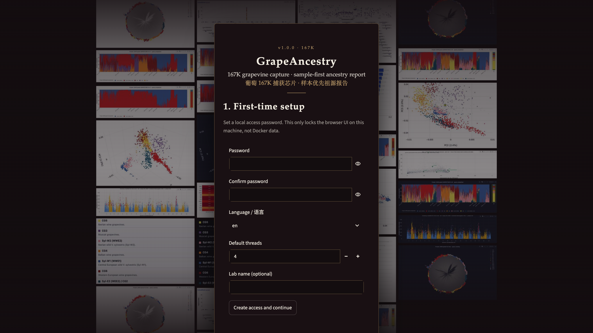

*First run — setup waterfall: local password, language, and threads (locks UI access only; does not encrypt data).*

The file under `demo/results/` is the 28-seed batch report. Stills below are from the Ages report. The Docker kit also ships HUN89_query — panel id `HUN89` ≠ report stem `HUN89_query`. Walkthrough: [`docs/GUIDELINE.md`](docs/GUIDELINE.md). Cite Ages/V5: Noraz et al. 2026 *Nat Commun* ([doi:10.1038/s41467-026-70166-z](https://doi.org/10.1038/s41467-026-70166-z)). Cite the 28 seeds: Ramos-Madrigal et al. 2019 *Nat. Plants* ([doi:10.1038/s41477-019-0437-5](https://doi.org/10.1038/s41477-019-0437-5)).

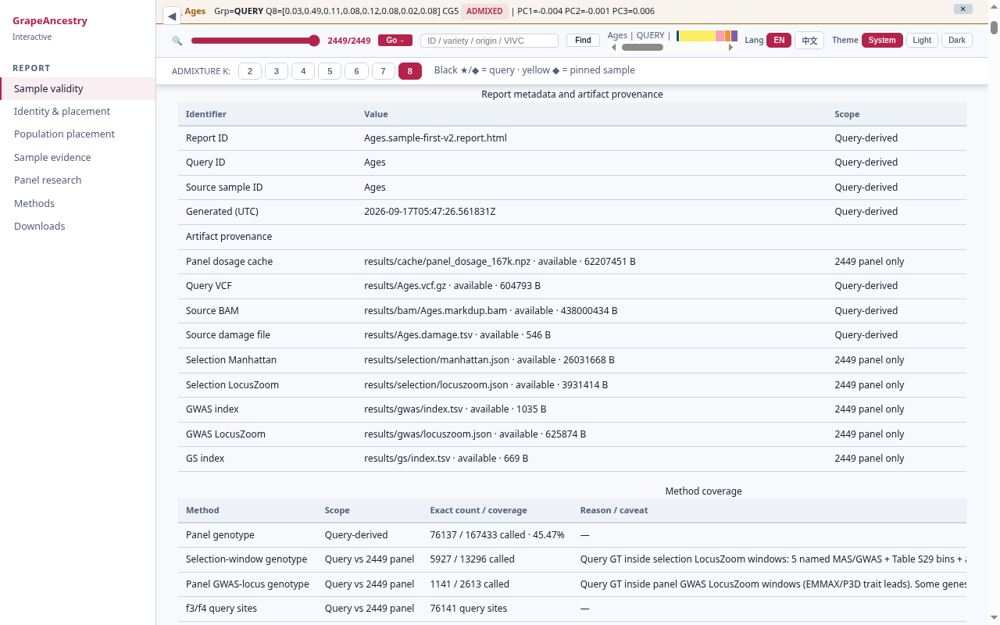

*Sample validity — report metadata and method coverage for the Ages aDNA demo (V5; Noraz et al. 2026).*

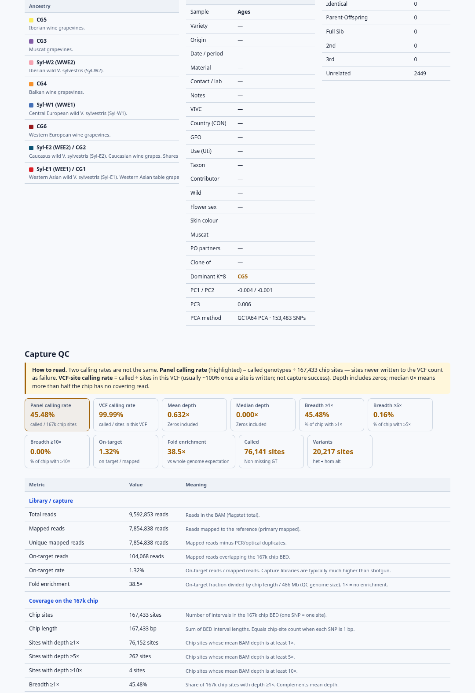

*Sample validity — capture QC (depth, calling, on-target) on the 167K sites.*

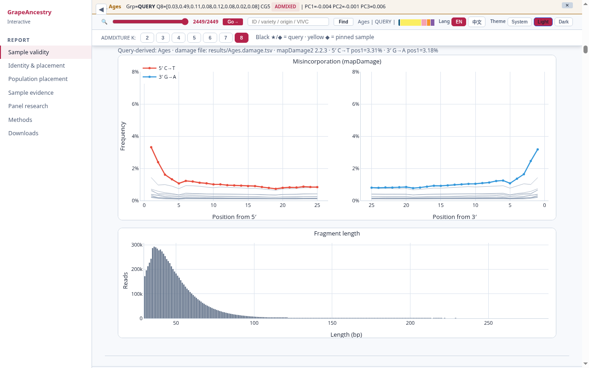

*aDNA damage — terminal misincorporation and fragment-length patterns (Ages).*

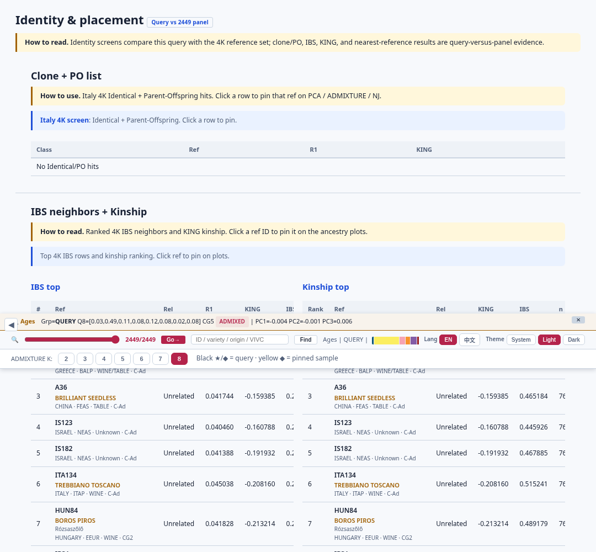

*Identity — Ages clone / parent–offspring screen and IBS kinship vs the frozen panel.*

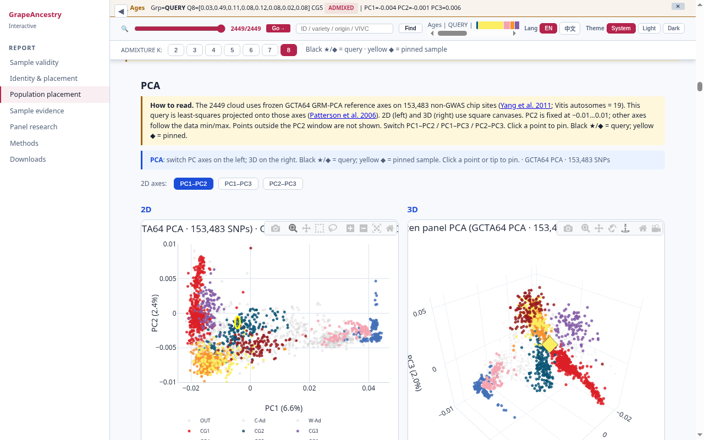

*Population — query projected onto frozen GCTA64 PCA axes (VS-1 frame).*

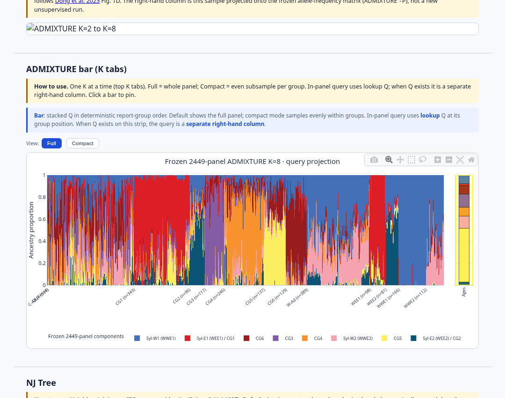

*Population — ADMIXTURE using frozen Q/P for K=2–8 (no 2449+N refit).*

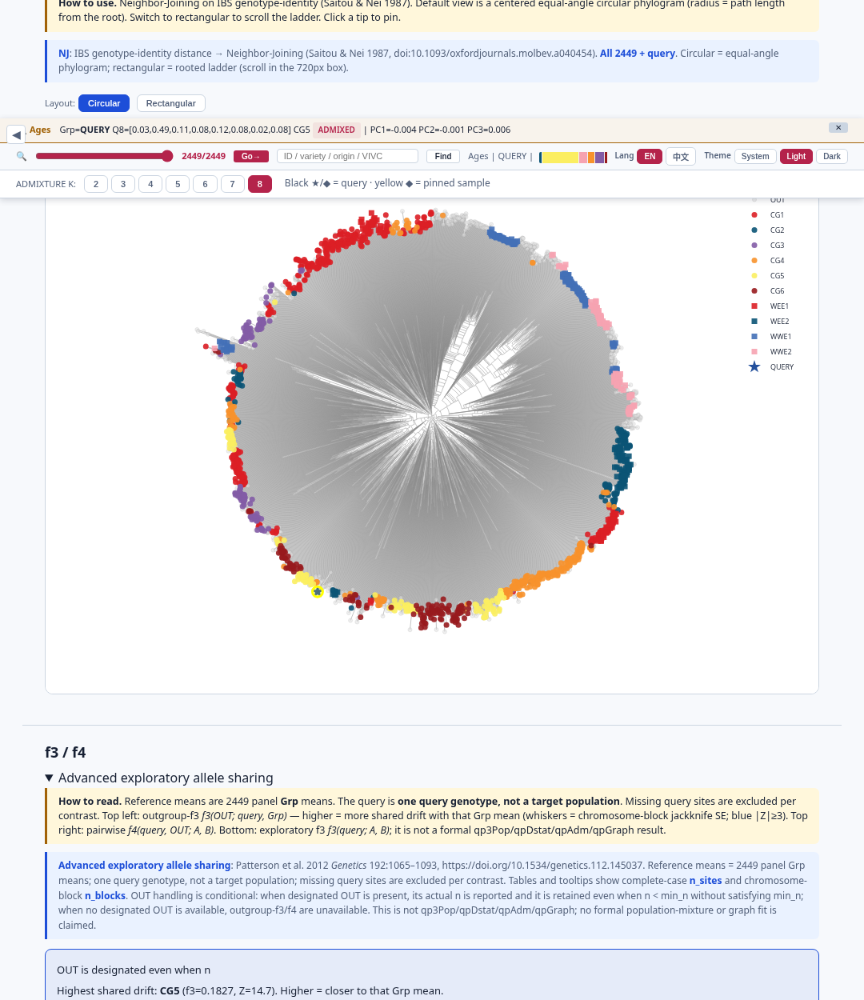

*Population — IBS neighbour-joining tree (use with identity tables).*

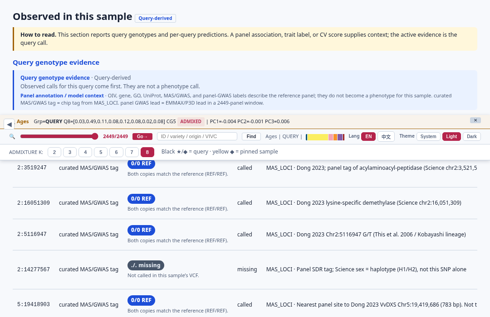

*Sample evidence — only **OIV 225** colour GS is decision-grade (**score ≠ phenotype**); SDR remains a proxy.*

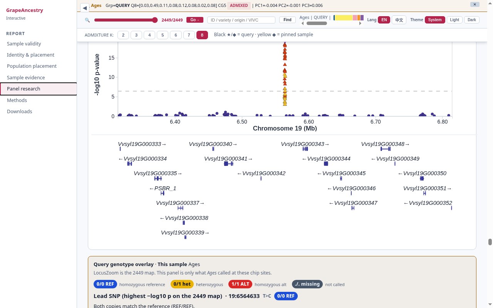

*Panel research — LocusZoom regional panel map with query GT overlay (overlay ≠ “this sample was selected”).*

## Docs

| Doc | Role |
|-----|------|
| [`DATA_NOTICE.md`](DATA_NOTICE.md) | What is / is not in git; Docker tar policy |
| [`demo/`](demo/) | 28-seed batch HTML (view-only) |
| [`steps/`](steps/) | DIY `00a`–`13b` |
| [`docs/USER_GUIDE.md`](docs/USER_GUIDE.md) | Start kit + browse; BAM/intake |
| [`docs/GUIDELINE.md`](docs/GUIDELINE.md) | How to read the report |
| [`docs/FAQ.md`](docs/FAQ.md) | First hour |
| [`docs/GLOSSARY.md`](docs/GLOSSARY.md) | Terms (167K vs 2449) |
| [`REPO_MAP.md`](REPO_MAP.md) | What each top-level folder holds |
| [`docs/CODE_AVAILABILITY.md`](docs/CODE_AVAILABILITY.md) | Git URL + Docker / Zenodo note |
| [`docs/FLOWCHART.md`](docs/FLOWCHART.md) | Flowchart claim caption |

## Author

**李旭真 / Li Xuzhen** · [ORCID 0000-0003-3670-6657](https://orcid.org/0000-0003-3670-6657)

Related: [gtbs-chip-service-kit](https://github.com/Xuzhen-Li/gtbs-chip-service-kit) · [grapevine-adna](https://github.com/Xuzhen-Li/grapevine-adna) · [genomics-theory-mining](https://github.com/Xuzhen-Li/genomics-theory-mining)
