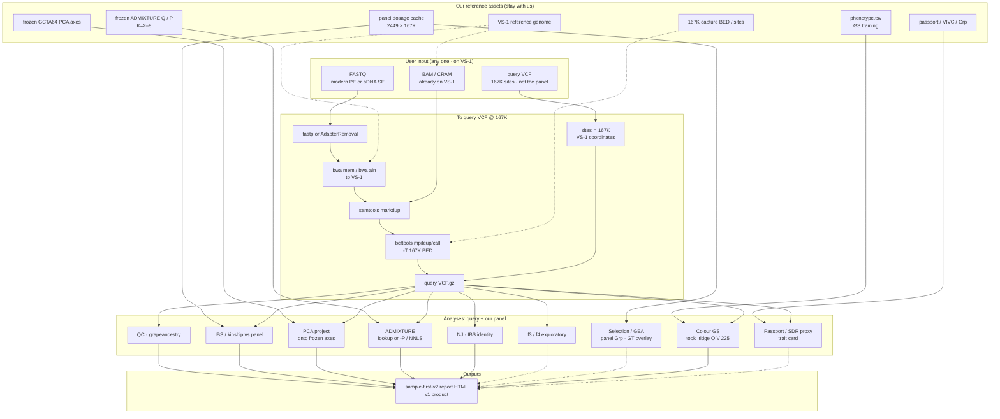

# GrapeAncestry analysis flow (what happens to your data)

**user input → our panel assets → software → analyses → outputs**

> **PNG note:** README embeds `flowchart_vs1_analysis_v2.png`. Until that art is redrawn, treat **this page’s Mermaid + caption** as authoritative for OIV 225 vs Do-not-claim dashed lines.

**Caption:** Inputs must be on **VS-1**. Your sample is then placed on a frozen 2449 × 167K reference; boxes name the software or asset at each step. **Solid** into the output = core path (QC · IBS · PCA · ADMIXTURE · NJ) plus **OIV 225** colour GS (only **decision-grade** score). **Dashed** = **Do not claim** as decision results (f3/f4 · selection/GEA overlay · passport/SDR proxy · other OIV) — exploratory / claim-bounded only.

## Lane legend

| Lane | Content |
|------|---------|
| User input | **FASTQ** or **BAM/CRAM on VS-1** or **query VCF @ 167K sites** (customer sample; not 2449 panel) |
| Our assets | VS-1, 167K BED, 2449 dosage, frozen PCA, frozen ADMIXTURE, passport, phenotype |
| Software | fastp/AdapterRemoval, bwa→VS-1, samtools, bcftools, grapeancestry, GCTA64 axes, ADMIXTURE |
| Analyses | QC, IBS, PCA project, ADMIXTURE, NJ, f3/f4, selection/GEA, GS, passport/SDR proxy |
| Output | v1: `*.sample-first-v2.report.html` · optional: `chip.json` (Chip Companion) |

## Honest boundaries (footnote)

- All genomic coordinates / mappings: **VS-1**.
- Panel = our **2449 × 167K** reference (not user upload).
- PCA / ADMIXTURE: frozen on 2449; query projected / `-P` / NNLS.
- SDR = proxy ≠ haplotype sex; OIV 225 only decision-grade; score ≠ phenotype; selection overlay ≠ selected.
- Mermaid: solid → output = core + OIV 225 decision-grade; dashed → Do not claim (SDR=proxy · selection=overlay · score≠phenotype · OIV241 exploratory).
