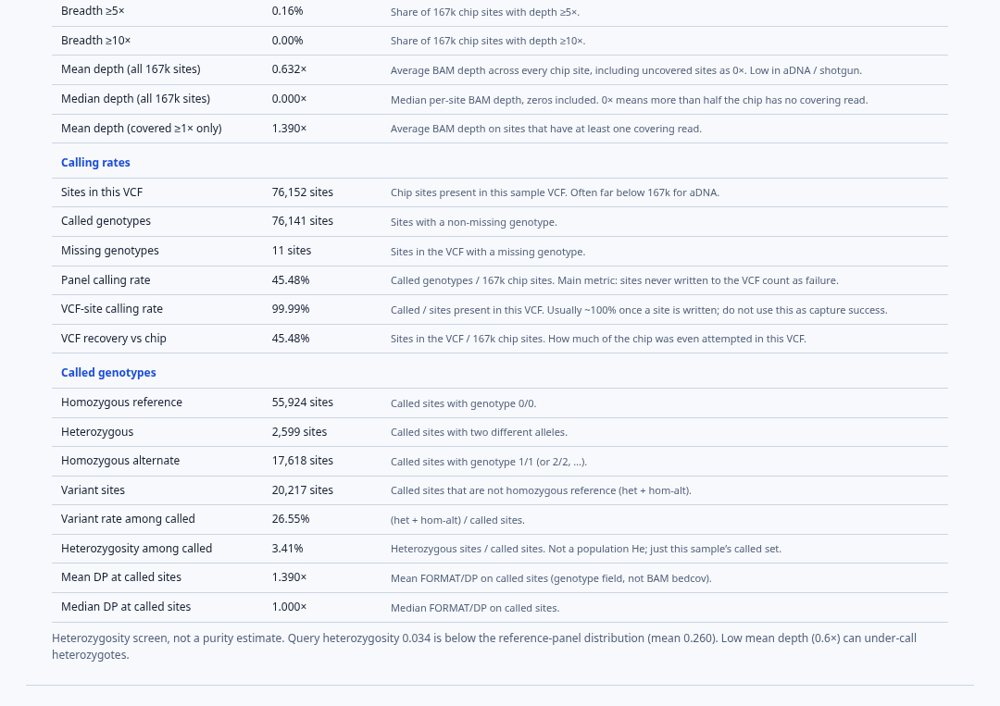
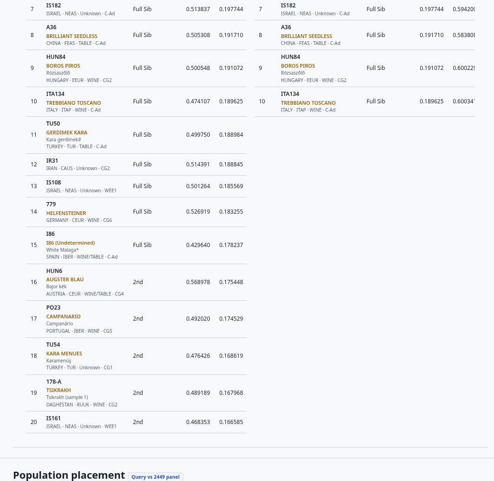
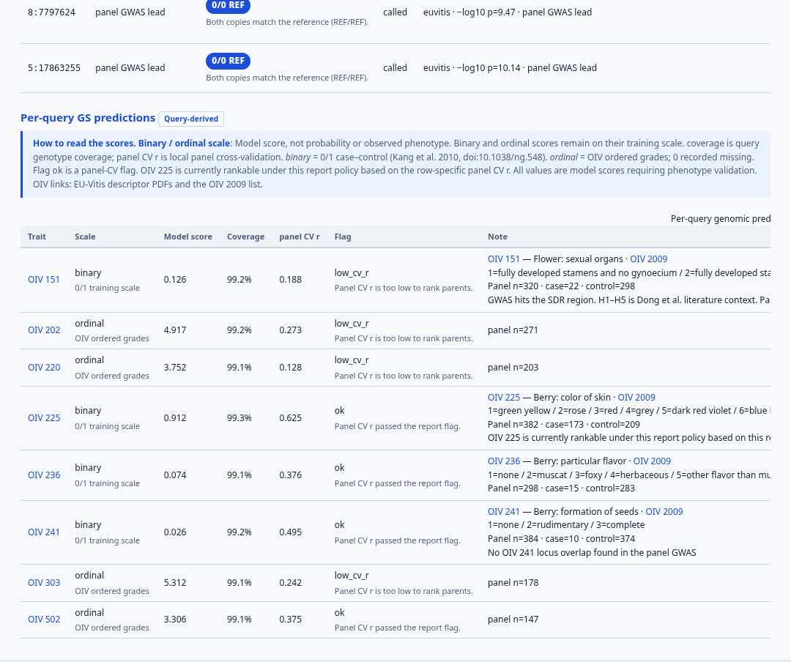
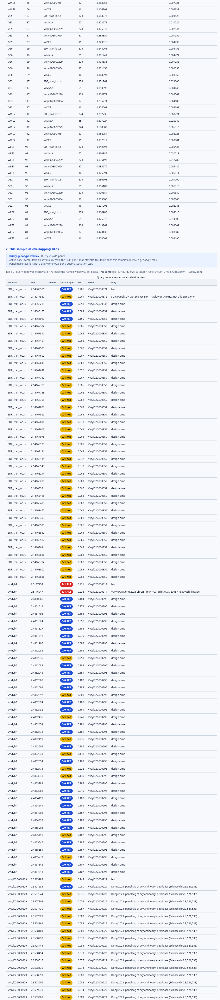
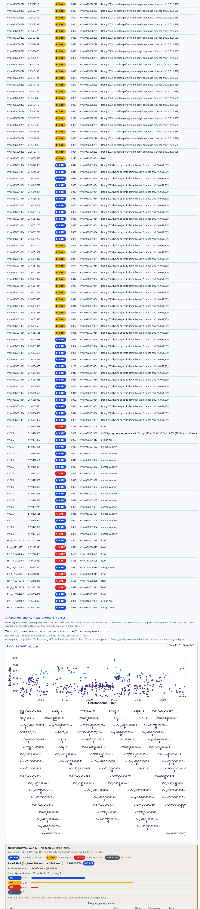
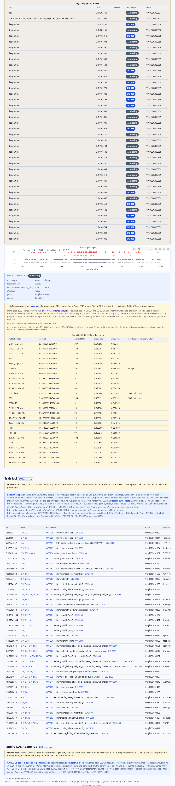
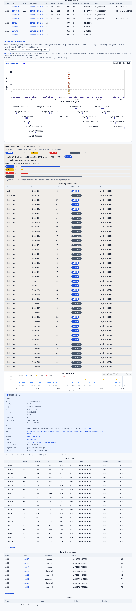
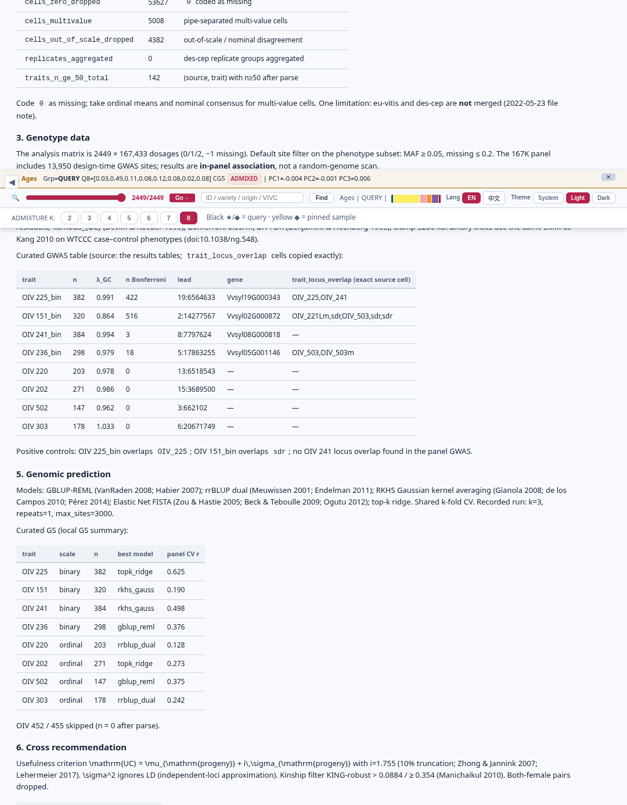
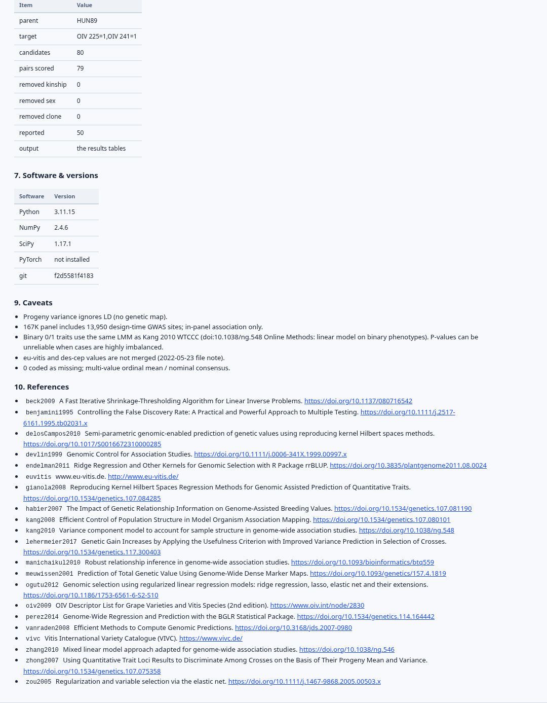

# GrapeAncestry guideline

**Status:** public docs and source on `Xuzhen-Li/grapeancestry`. **Analyze** requires the private Docker tar (not in git).  
**Language:** English primary.

This page covers:

1. **How to use** the product as it exists today (three lanes).
2. **How to read** the demo HTML report — every sidebar section and every screenshot below has an intro.

Diagram: [`flowchart_vs1_analysis_v2.png`](flowchart_vs1_analysis_v2.png) · [`USER_GUIDE.md`](USER_GUIDE.md) · [`FLOWCHART.md`](FLOWCHART.md) · Cloud notes: [`CHIP_COMPANION.md`](CHIP_COMPANION.md).

---

## Final-package inputs (all on VS-1)

| Input | What happens | What it is *not* |
|-------|----------------|------------------|
| **FASTQ** (modern PE or aDNA SE) | Trim → map to **VS-1** → markdup → `bcftools` call at the **167K BED** | Not a whole-genome resequencing deliverable |
| **BAM / CRAM** | Must already be on **VS-1** (`@SQ` names overlap VS-1). Then markdup → call at 167K | 12X / PN40024 / wrong reference will fail |
| **Query VCF** | Sites ∩ 167K on VS-1 coordinates → analyses only | **Not** the 2449 × 167K panel matrix |

**ID trap:** panel row `HUN89` ≠ capture/report stem `HUN89_query` (independent FASTQ recapture). Do not strip `_query` to look up passport or frozen Q.

**Claim boundaries (read before you cite anything):**

- Only **OIV 225** colour GS is decision-grade / rankable today.
- **SDR** = unphased window **proxy**, not Science haplotype sex (H1–H5).
- **Selection** = 2449 panel Grp-vs-rest context; query GT is overlay ≠ “this sample was selected”.
- **GS score ≠ phenotype**; GWAS p/β are panel results, not the customer’s measured trait.

> **v1 product output:** `*.sample-first-v2.report.html` (Docker UI). Optional Cloud `chip.json` — see CHIP_COMPANION (not v1 primary).

---

## Usage flow (how it is used today)

Three paths. Pick **one** path; the **primary output** filename must match that path.

### Public docs (this GitHub tree)

**Who:** Anyone reviewing the repository without the private fat image.

**Steps:**

1. Clone or browse `https://github.com/Xuzhen-Li/grapeancestry`.
2. Read this GUIDELINE top-to-bottom (usage → report walkthrough).
3. Open [`USER_GUIDE.md`](USER_GUIDE.md) · [`FLOWCHART.md`](FLOWCHART.md) for the analysis boxes; [`CHIP_COMPANION.md`](CHIP_COMPANION.md) for Cloud vs Lab paths.
4. Use the screenshots below as a stand-in for the interactive HTML (GitHub cannot run the report in-repo).

**Note:** this tree does **not** ship a runnable `grapeancestry` binary, VS-1, or the 2449 dosage cache. Commands in Lane B live in the private suite package.

### Local suite (developer / lab Mac)

**Who:** Machine with private panel assets (lab checkout or fat image).

**Install (once):**

```bash
# use a venv/conda env with: bwa fastp snakemake bcftools samtools python=3.11
cd /path/to/grapeancestry   # repo or customer drop root
pip install -e ".[dev,web]"
export PATH="$PWD/bin:$PATH"   # ADMIXTURE 1.3.0 wrapper
grapeancestry --help
```

**End-to-end demo (FASTQ → 167K VCF → analyses → HTML):**

```bash
grapeancestry run --config config/mbp_demo.yaml --samples config/samples_demo.yaml \
  --sample HUN89 --mapping full -j 4
# Modern PE path: fastp → bwa mem → VS-1 → markdup → bcftools -T 167K BED
# → results/HUN89*.vcf.gz + sample-first V2 HTML under results/
```

Ages aDNA SE demo: `--samples config/samples_ages.yaml --sample Ages` (AdapterRemoval + `bwa aln`).

**If you already have a query VCF** (sites on VS-1 ∩ 167K), skip mapping and run post-VCF pieces, for example:

| Goal | Typical command (suite) |
|------|-------------------------|
| Rebuild QC + identity + HTML | `grapeancestry analyze …` (see suite `--help`) |
| IBS / clone screen | `grapeancestry identity --vcf … --sample …` |
| PCA project onto frozen axes | `grapeancestry project --vcf … --sample …` |
| ADMIXTURE for new IDs | `grapeancestry admix-project --vcf …` (lab `-P`) |
| Optional Cloud `chip.json` | `grapeancestry chip-report --vcf sample.vcf.gz --out chip.json` |
| Pack Streamlit demos | `python -m grapeancestry.cloud` then `streamlit run app.py` |

**View an existing demo report (view-only):**

```bash
cd /path/to/grapeancestry   # repo or customer drop root   # must be suite root so ../assets resolve
python -m http.server
# open http://localhost:8000/results/Ages.sample-first-v2.report.html
```

`http.server` is view-only. v1 product report is `*.sample-first-v2.report.html` from Docker; optional Cloud JSON is `chip.json`.

**What “done” looks like for Suite:** `*.sample-first-v2.report.html` opens with assets; method coverage shows available vs unavailable; no decision-grade claim beyond OIV 225.

### Cloud Chip Companion (optional, not v1 product)

**Who:** Streamlit Cloud (or local `streamlit run app.py`) with packed `data/cloud/` fingerprints.

**Steps:**

1. Prepare a **167K-site query VCF** (not FASTQ).
2. Open the Chip Companion app → upload VCF or pick a named demo.
3. Scan top-to-bottom: QC → self-vs-clone IBS → passport / SDR **proxy** / trait card → purity & parentage → (optional advanced) → **colour GS last**.
4. Export **`chip.json`** when using the optional Cloud path (not the v1 Docker product).

**Note:** Cloud has no bwa/bcftools/ADMIXTURE binary; new samples use NNLS onto frozen P. Docker / HPC (`environment-hpc.yml`, `docker compose up`) is the lab image path — not the Cloud VCF-only path.

### After you have a report — how to read it

**Sidebar order (left):**

1. Sample validity  
2. Identity & placement  
3. Population placement (PCA · ADMIXTURE · NJ)  
4. Sample evidence  
5. Panel research (selection / GEA / **LocusZoom**)  
6. Methods  
7. Downloads  

**Chrome controls:**

- Black ★/♦ = **query**; yellow ♦ = **pinned** reference. Click a table row or plot point to pin; pinned IDs overlay PCA / ADMIXTURE / NJ.
- ADMIXTURE **K = 2…8** buttons change the Q bar / legend, not the frozen panel fit.
- Lang EN / 中文; Theme Light / Dark / System.
- Search: ID / variety / origin / VIVC when passport fields exist.

Screenshots below are **non-overlapping panel crops** (no full+viewport duplicates). Panel research stays coarse; **one dedicated LocusZoom** shot is included.

---

## Walk the demo report

This walkthrough uses the **`Ages`** sample-first-v2 report HTML (aDNA SE; archaeological sample **V5**). Cite: Noraz et al. 2026 *Nat Commun* ([doi:10.1038/s41467-026-70166-z](https://doi.org/10.1038/s41467-026-70166-z); incl. **Ludovic Orlando**). Screenshots below are **non-overlapping panel crops** (no full+viewport duplicates). Panel research stays coarse; **one dedicated LocusZoom** shot is included.

Demo stem: `Ages` (aDNA SE from V5 / Iron Age Martigues). Modern PE recaptures (e.g. `HUN89_query`) are a separate door — do not confuse panel IDs with aDNA demo stems.

### 1 · Sample validity

**Background.** High-throughput DNA capture panels applied to historical, degraded, or modern plant material require rigorous initial validation before downstream population and predictive workflows. This layer flags anomalies early, preventing technical artifacts from propagating into PCA projection and genomic selection.

**What the report shows.** Provenance (report / query / source IDs, artifact paths), method coverage, capture QC (depth, calling, on-target), and whether aDNA damage applies for the library type.

**How a careful reader uses it.**

1. Inspect missingness and depth across the 167K targets.
2. Verify alignment / coordinates match **VS-1**.
3. Treat heterozygosity as a **screen**, not a purity call.
4. Confirm identifier integrity (`query_id` vs `source_sample_id`; keep `_query`).
5. If calling rate or depth look broken, **stop** — do not interpret IBS or GS yet.

**What you may claim / must not claim.**

- **Allowed:** Whether the sample meets baseline QC for downstream 167K analysis; which methods are available vs unavailable.
- **Forbidden:** That high QC alone proves parentage or authenticates field passport records.

**Bridge.** Once technical validity is confirmed, establish genetic identity against the frozen 2449 panel.


*What you see:* Report metadata, artifact paths (incl. Selection / GWAS LocusZoom JSON), method coverage, auto conclusions.  
*How to read:* Confirm IDs and library type. Modern PE should not show ancient-DNA damage patterns.


*What you see:* On-target, depth, breadth, calling rate, heterozygosity summary.  
*How to read:* Calling rate and depth gate overlays. Heterozygosity ≠ purity — use Identity for that.



*What you see:* Damage / aDNA module status.  
*How to read:* Missing damage on modern PE is expected; meaningful mainly for SE aDNA libraries.

### 2 · Identity & placement

**Background.** Robust identity means separating true biological accessions from technical recaptures and mapping the query into cultivar space without mixing panel keys and report stems.

**What the report shows.** Clone / parent–offspring screens, IBS and KING neighbors, passport / Grp when available. Pinning a row overlays that reference (yellow ♦) on Population plots.

**How a careful reader uses it.**

1. Check Identical + PO first.
2. Keep panel `HUN89` ≠ stem `HUN89_query` — never strip `_query` for passport / Q lookup.
3. Scan IBS / kinship tops; pin one neighbor at a time.
4. Treat mid-rank IBS hits as **not** variety names.

**What you may claim / must not claim.**

- **Allowed:** Closest panel matches and kinship **screens** from the 167K distance metrics.
- **Forbidden:** Legal pedigree from a mid-list IBS score alone; stripping `_query` to borrow panel Q/passport.

**Bridge.** With identity set, place the query on frozen PCA / ADMIXTURE / NJ axes.


*What you see:* Clone + PO list and top IBS / kinship for `HUN89_query`.  
*How to read:* Identical to panel `HUN89` is expected for this demo recapture; PO / sib ranks are hints, not certificates.



*What you see:* Continued neighbor tables.  
*How to read:* Pin → jump to Population plots with the yellow diamond active.

### 3 · Population placement (PCA · ADMIXTURE · NJ)

**Background.** Global context means projecting onto **pre-computed** axes without unsupervised 2449+N refits: least-squares PCA, frozen ADMIXTURE Q lookup or `-P` / NNLS, and NJ on IBS identity.

**What the report shows.** Interactive GCTA64 PCA (2D/3D), ADMIXTURE K=2–8, NJ tree. Chrome: black ★/♦ = query; yellow ♦ = pinned; K toggles; EN/中文; theme.

**How a careful reader uses it.**

1. Read PCA position on frozen axes (switch PC pairs if needed).
2. Toggle K=2…8 for Q proportions.
3. Check NJ clade with the same pin from Identity.
4. Ask whether methods agree on Grp / CG neighborhood.

**What you may claim / must not claim.**

- **Allowed:** Least-squares projection onto frozen GCTA64 axes; Q from lookup or `-P` / NNLS.
- **Forbidden:** Claiming an unsupervised refit of 2449+N; treating NJ as a dated phylogeny.

**Bridge.** Macro placement done — next, local allele evidence at MAS / GWAS / trait sites.


*What you see:* 2D + 3D GCTA64 PCA; black star = query.  
*How to read:* Metadata should say frozen GCTA64 GRM-PCA (`panel167k_nogwas`).


*What you see:* ADMIXTURE components for K=2–8.  
*How to read:* In-panel = frozen Q lookup; new IDs = `-P` (lab) or NNLS (Cloud).


*What you see:* NJ on IBS identity.  
*How to read:* Visual neighbor aid — use with IBS tables, not instead of them.

### 4 · Sample evidence

**Background.** This layer answers what **this query called** at curated MAS / GWAS / trait sites. Labels describe **panel** context; observed GT is not a phenotype.

**What the report shows.** Genotype evidence tables (curated tags and panel GWAS leads), passport / SDR **proxy**, trait cards, colour GS scores.

**How a careful reader uses it.**

1. Read the caveat box first.
2. Scan GT pills (0/0, 0/1, 1/1).
3. For breeding decisions, only treat **OIV 225** as rankable.
4. Treat SDR / seedless / other OIV cards as proxy or exploratory.

**What you may claim / must not claim.**

- **Allowed:** Observed allele calls; unphased SDR-window **proxy** state; OIV 225 GS as decision-grade score.
- **Forbidden:** SDR proxy = Science haplotypes H1–H5; GS score = field phenotype; OIV 241 / seedlessness for parent ranking.

**Bridge.** Individual evidence leads into panel-wide selection / GWAS maps with query overlay.


*What you see:* Site · evidence type · query GT · panel annotation.  
*How to read:* Colour pills = genotype, not phenotype; −log10 p on leads is from the 2449 map.



*What you see:* Trait / MAS cards and GS rows.  
*How to read:* Only OIV 225 (`topk_ridge`, panel CV *r* ≈ 0.625) is decision-grade today.

### 5 · Panel research

**Background.** GWAS and selection scans use the **2449** frozen panel. Overlaying the query bridges individual genotypes to population quantitative genomics without claiming the customer sample was “selected.”

**What the report shows.** Genome-wide selection / sweep context, named windows, heatmaps, GWAS index, and paths into Selection / GWAS LocusZoom. Query GT appears only as overlay.

**How a careful reader uses it.**

1. Read panel Manhattan / tables first.
2. Open LocusZoom for a named window or GWAS lead.
3. Keep OIV 225 as the only decision-grade GS boundary.
4. Treat f3/f4 and OIV 241 as exploratory.

**What you may claim / must not claim.**

- **Allowed:** Panel selection / GWAS context; query GT at overlapping sites; OIV 225 GS within decision scope.
- **Forbidden:** “This sample was selected”; score = phenotype; seedlessness / OIV 241 ranking (case_n=10 / control_n=374); f3/f4 as formal qpAdm/qpGraph.

**Bridge.** Methods document how each number was made; LocusZoom is the interactive regional lens.


*What you see:* Genome-wide selection / sweep-style scans and related tables.  
*How to read:* Sweep rules are panel Grp-vs-rest; click toward LocusZoom.



*What you see:* Query genotypes inside named / selection windows.  
*How to read:* Overlay only — does not move the panel Fst map.



*What you see:* Regional among-Grps context and LocusZoom entry.  
*How to read:* Pick window and Y metric; colour = panel r².



*What you see:* Window summaries and trait-locus indexes.  
*How to read:* Bibliography + interval checklist before a gene story.



*What you see:* Panel GWAS / GS index into the LocusZoom stack.  
*How to read:* Prefer OIV 225 for decision talk; then open §5b.

### 5b · LocusZoom

**Background.** LocusZoom.js 0.14.0 links population-level statistics to one sample’s genotypes. Sidebar: **Selection LocusZoom** and **GWAS LocusZoom**.

**What the report shows.** Scatter = **panel** map (GWAS −log10 *p*, or selection Fst / windowed het; colour = panel r²). Strip / table below = **this query’s** genotypes at matching coordinates.

**How a careful reader uses it.**

1. Pick window / trait from the dropdown.
2. Set Y (association vs Fst / het).
3. Drag to pan, scroll to zoom, click SNP or gene.
4. Read the query overlay separately from the panel scatter.

**What you may claim / must not claim.**

- **Allowed:** Panel association or selection context at a locus; what the query called at lead / design sites.
- **Forbidden:** That query GT proves selection on this sample; that p/β are this plant’s phenotype.


*What you see:* Example GWAS LocusZoom for **OIV 225** on chr19 (lead `19:6564633`, gene track, `HUN89_query` overlay).  
*How to read:* p / β / MAF / r² from 2449 EMMAX/P3D; query strip = calls only.

### 6 · Methods

**Background.** Reproducibility needs explicit software, frozen assets, and statistical assumptions — not a black-box WGS story.

**What the report shows.** Method cards for QC, identity, projection, ADMIXTURE, GS, selection / GEA, and assembly caveats.

**How a careful reader uses it.** When a plot surprises you, jump here for the exact method string (GCTA64 projection, ADMIXTURE lookup vs `-P`, simplified Fst).

**What you may claim / must not claim.**

- **Allowed:** Cite VS-1, 167K panel design, frozen axes, and named models.
- **Forbidden:** Presenting the suite as unsupervised WGS ancestry or omitting the fixed capture design.


*What you see:* QC / identity method narrative.  
*How to read:* Match paths back to Sample validity provenance.



*What you see:* PCA / ADMIXTURE / relatedness methods.  
*How to read:* Confirm frozen axes / frozen Q language.



*What you see:* GS, selection / GEA, f-stats caveats.  
*How to read:* Re-check OIV 225-only decision scope.

### 7 · Downloads

**Background.** Exportable, query-scoped artifacts support archiving and secondary analysis without shipping the full 2449 matrix.

**What the report shows.** Links to query-only sidecars tied to this report stem. v1 product report remains `*.sample-first-v2.report.html`; optional Cloud JSON remains `chip.json`.

**How a careful reader uses it.** Download what you need; do not expect panel VCFs here. Missing links mean the method was unavailable (see Sample validity).

**What you may claim / must not claim.**

- **Allowed:** Store standard deliverables generated for this query.
- **Forbidden:** Mixing Cloud and Suite filenames; treating downloads as a full public panel dump.


*What you see:* Query-scoped download links.  
*How to read:* The **deliverable** / primary output is a **filename**, not every sidebar tab.

---


## Privacy

No unpublished genotypes, private coordinates, or full 2449 matrices in public demos.

## Related

[`CHIP_COMPANION.md`](CHIP_COMPANION.md) · [`USER_GUIDE.md`](USER_GUIDE.md) · [`FLOWCHART.md`](FLOWCHART.md) · https://github.com/Xuzhen-Li/grapeancestry
