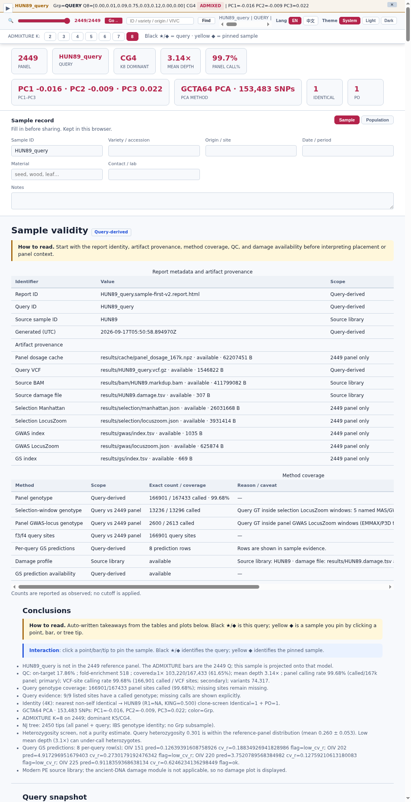
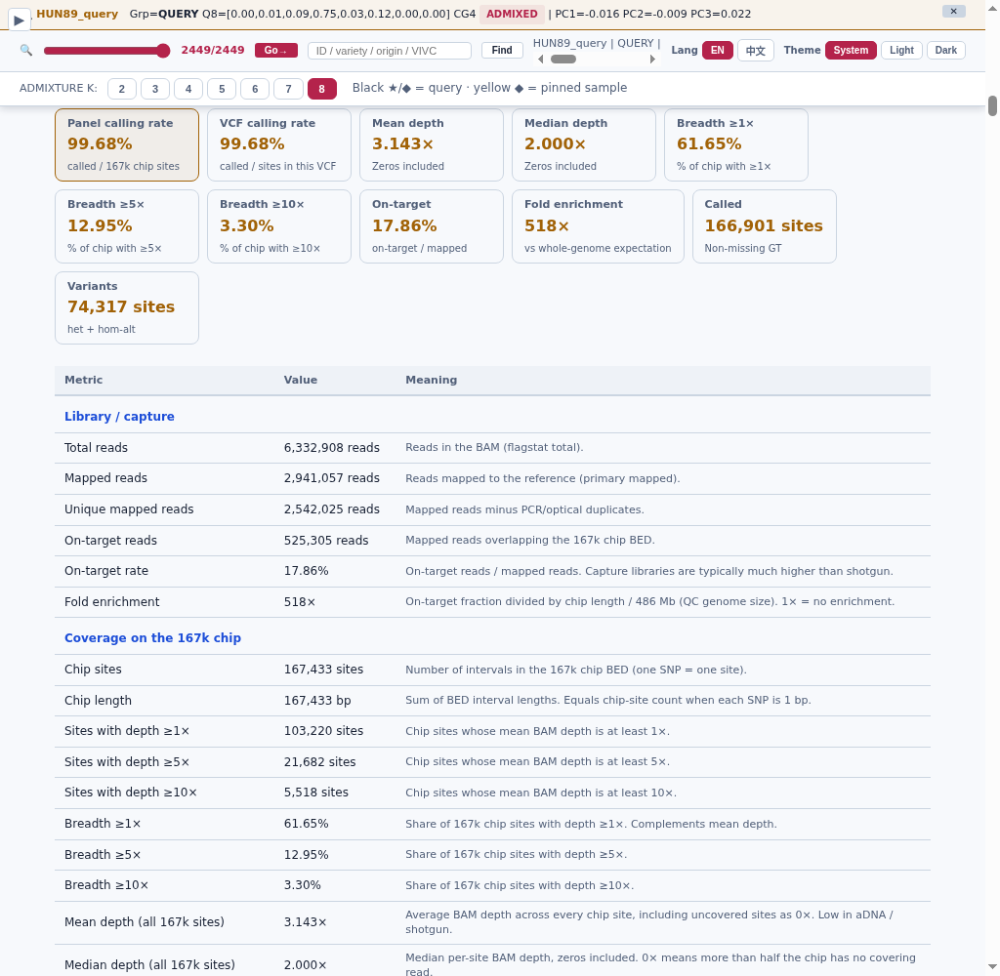
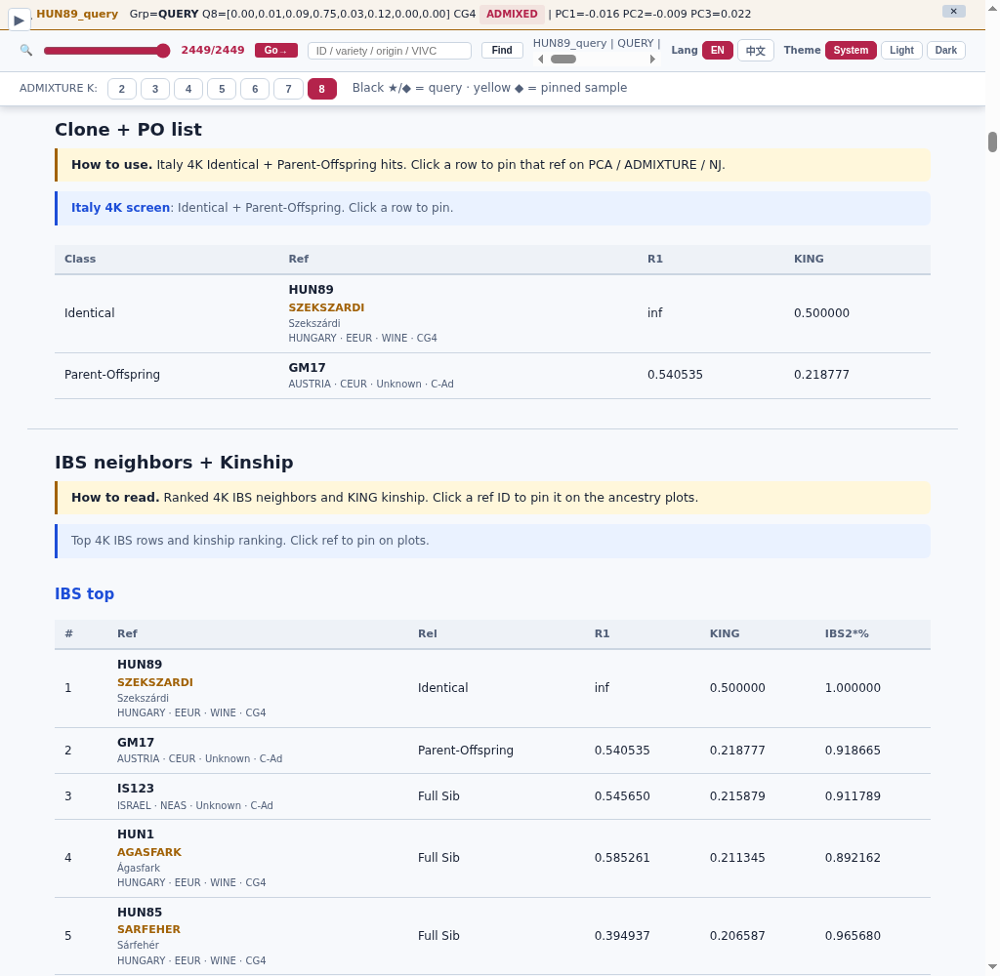
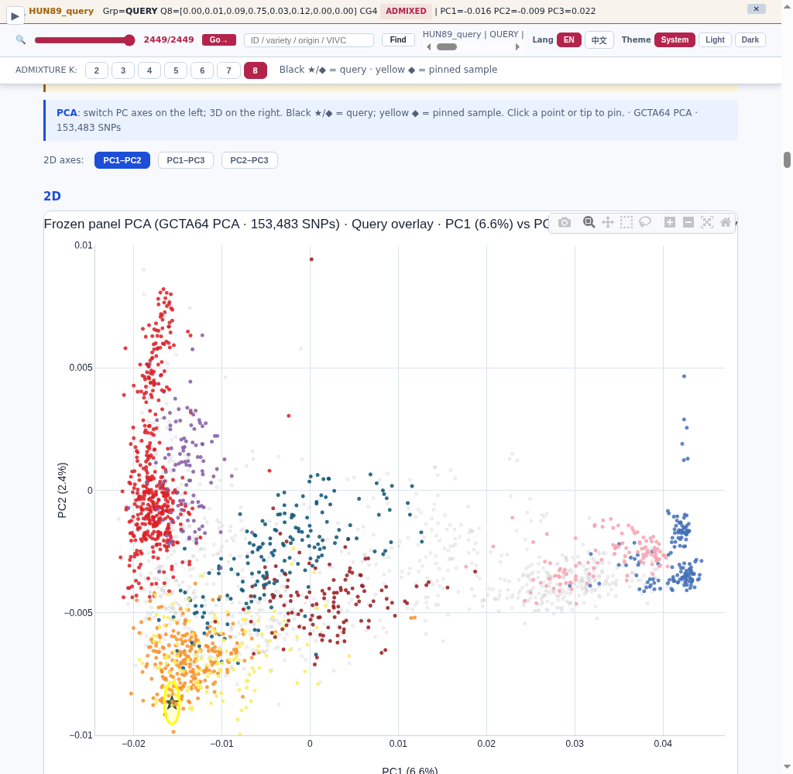
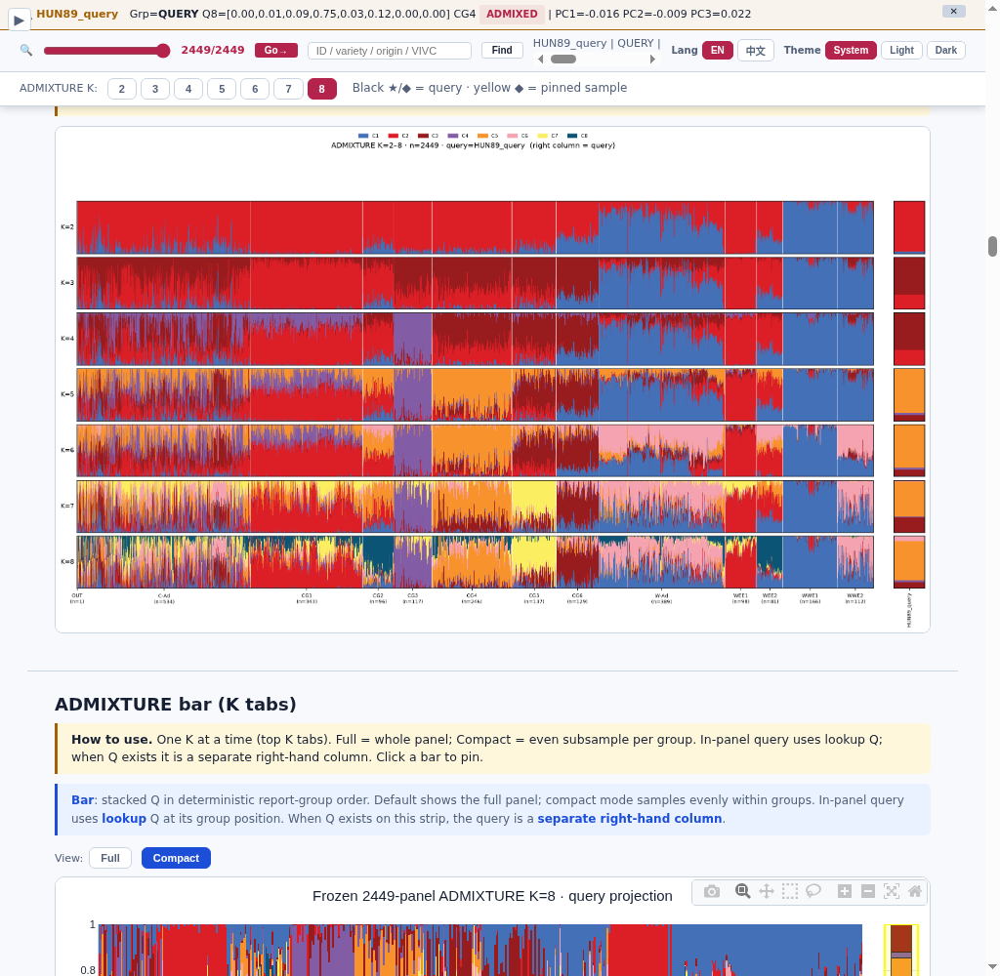
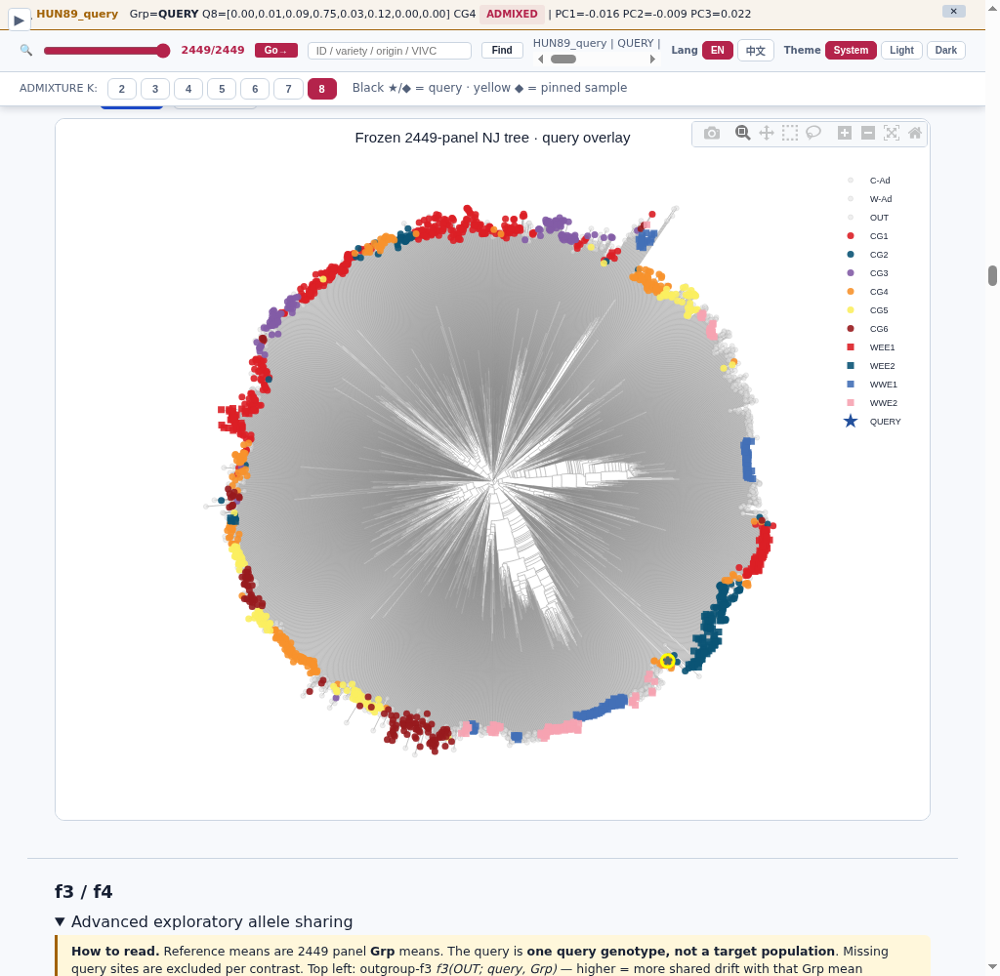

# GrapeAncestry guideline (chip companion)

**Status:** public docs on `Xuzhen-Li/grapeancestry` (demo walkthrough + claim boundaries). Full suite code and panel matrices land later; do not expect `grapeancestry run` from this repo yet.  
**Language:** English primary for public files; Chinese teaching notes may live in Companion.

## Tonight — two doors (pick one)

### ID trap (read once)

Panel demo `HUN89` (2449-row ID) ≠ capture demo `HUN89-capture` / report stem `HUN89_query` (independent FASTQ recapture).

| Door | Audience | Tonight deliverable | Not tonight |
|------|----------|---------------------|-------------|
| **Cloud** | Upload 167K VCF → Streamlit | `chip.json` | Docker / HPC / ADMIXTURE binary / full FASTQ pipeline |
| **Suite** | Local `grapeancestry run` + report | `*.sample-first-v2.report.html` | Claiming OIV 241 / seedlessness / haplotype sex |

### Done when (≤3)

- [ ] Door chosen; deliverable filename matches the door
- [ ] VCF sites align to the 167K panel (Cloud) **or** report opens with assets resolved (Suite)
- [ ] No decision-grade claim beyond **OIV 225 colour GS** (OIV 241 = exploratory only)

## What you get (scan order)

1. QC  
2. Self-vs-clone IBS / identity  
3. Passport / SDR **proxy** (not Science H1–H5 haplotype sex) / trait card  
4. Purity screen & parentage (screens, not final calls)  
5. Advanced: f3/f4, local ancestry, NJ, GEA/Fst, impute  
6. **Colour GS last** — only OIV 225 is currently rankable

## Decision / explore / do-not-claim

| Class | Trait / claim | Rule |
|-------|---------------|------|
| Decision-grade | OIV 225 colour GS | May rank when policy + evidence say so |
| Exploratory | OIV 241, unbalanced case/control | Demo only; never parent ranking / seedlessness claim |
| Do not claim | SDR = haplotype sex; query GT = selection | SDR = unphased window **proxy** (not Science H1–H5); selection overlay ≠ “this sample was selected” |
| Do not claim | OIV 241 / seedlessness / `flag=ok` on unbalanced traits | Demo `gs_pred` must not mark OIV 241 as decision-grade; mate `--target` with OIV 241 = exploratory only |
| Reminder | Model score | **Score ≠ observed phenotype** |

## Later

Docker / HPC lab (`docker compose up`), full FASTQ→VCF, ADMIXTURE `-P`. Missing demo VCFs → missing `demo_*.npz` is **expected**, not a failed command.


## Walk the demo report

Demo: `results/HUN89_query.sample-first-v2.report.html` (English UI).  
Open from the suite root so `../assets/` resolves:

```bash
cd grapeancestry_suite
python -m http.server
# http://localhost:8000/results/HUN89_query.sample-first-v2.report.html
```

### 1 · Sidebar + overview



Scan order starts here: sample pin, panel/query stats, Sample validity, Conclusions.

### 2 · Capture QC



Query-derived QC. Heterozygosity screen ≠ purity call.

### 3 · Identity (IBS / kinship)



Query vs 2449 panel. Click a ref ID to pin it on PCA / ADMIXTURE / NJ.

### 4 · PCA



Frozen GCTA64 GRM-PCA axes; query is a least-squares projection onto those axes.

### 5 · ADMIXTURE K=2–8



In-panel IDs look up frozen Q; new samples use `-P` (lab) or NNLS (Cloud).

### 6 · NJ tree



IBS genotype-identity Neighbor-Joining. Tip click pins the same ref.


## Privacy

No unpublished genotypes, private coordinates, or full 2449 matrices in public demos.

## Related docs

- [`CHIP_COMPANION.md`](CHIP_COMPANION.md) — Cloud / Suite teaching companion (bilingual notes kept as drafted)
- `METHODS_breeding.md` — local / later (not in this repo yet)
- Repo overview: [`README.md`](../README.md)
